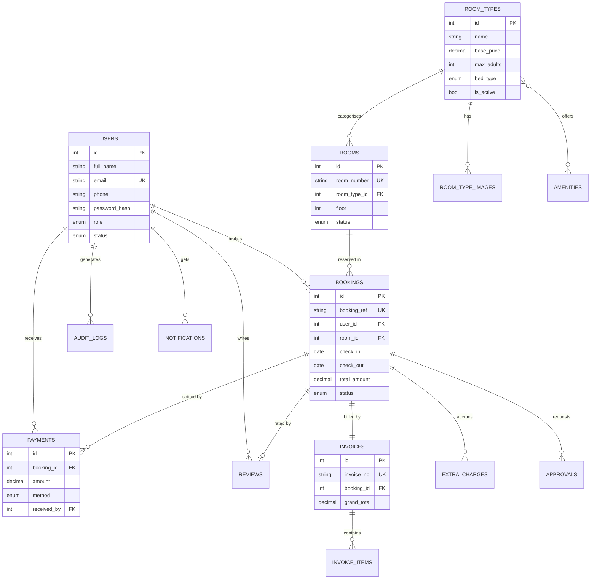

# Hotel Reservation System
# Hotel Reservation System — Project Specification

**Module:** CST 226-2 Web Application Development
**Assignment:** Group Project (7 members)
**Selected Topic:** Hotel Reservation System
**Stack:** PHP 8.x (no framework), MySQL 8 / MariaDB, HTML5, CSS3, Vanilla JavaScript (ES6)
**Environment:** XAMPP (Apache + MySQL + PHP)
**Project root:** `C:\xampp\htdocs\Hotel Reservation System`
**Local URL:** `http://localhost/Hotel%20Reservation%20System/`

> This document is the single source of truth for the whole group. **Read this fully before writing any code.**
> Nobody writes a line of code until the folder structure, database schema, and CSS design tokens in this document exist in the repository.

---

## Table of Contents

1. [Project Overview](#1-project-overview)
2. [Design Principles & Hard Rules](#2-design-principles--hard-rules)
3. [User Roles & Permissions](#3-user-roles--permissions)
4. [System Features (Complete List)](#4-system-features-complete-list)
5. [Page Inventory](#5-page-inventory)
6. [Work Breakdown — 7 Members](#6-work-breakdown--7-members)
7. [Folder & File Structure](#7-folder--file-structure)
8. [OOP Architecture](#8-oop-architecture)
9. [Database Design](#9-database-design)
10. [Security Specification](#10-security-specification)
11. [UI/UX Design System](#11-uiux-design-system)
12. [Validation Rules](#12-validation-rules)
13. [Coding Standards](#13-coding-standards)
14. [Git Workflow](#14-git-workflow)
15. [Setup Instructions](#15-setup-instructions)
16. [Development Timeline](#16-development-timeline)
17. [Testing Checklist](#17-testing-checklist)
18. [Assignment Criteria Mapping](#18-assignment-criteria-mapping)
19. [Project Report Checklist](#19-project-report-checklist)
20. [Demonstration Script](#20-demonstration-script)

---

## 1. Project Overview

### 1.1 Problem Statement

Small and mid-sized hotels in Sri Lanka still manage room bookings with paper registers, phone calls, and spreadsheets. This causes:

- **Double bookings** — two guests assigned the same room for overlapping dates.
- **No real-time availability** — guests must call to check if a room is free.
- **Lost revenue records** — payments and extra charges recorded on loose paper.
- **No reporting** — management cannot see occupancy rate or monthly revenue.
- **Slow check-in/check-out** — front desk manually searches the register.

### 1.2 Proposed Solution

A web-based Hotel Reservation System where:

- **Guests** browse rooms, search live availability by date range, book online, manage their own bookings, and leave reviews after checkout.
- **Receptionists** handle walk-in bookings, check-in/check-out, room housekeeping status, record payments, and print invoices.
- **Managers** approve cancellations/refunds and discounts, moderate reviews, and view occupancy/revenue reports.
- **Admins** manage staff accounts, room types, rooms, system settings, and view the audit log.

### 1.3 Scope Boundaries (What we deliberately DO NOT build)

Keeping the project **simple but reliable** is a graded goal. The following are explicitly out of scope:

| Out of scope | Reason |
|---|---|
| Real online payment gateway | Security/PCI risk, needs merchant account. We use **Pay-at-Hotel** + invoice printing. |
| Email/SMS sending | Needs SMTP credentials; unreliable in a demo. Use in-app notifications instead. |
| Multi-hotel / multi-branch | Massively increases schema complexity. Single hotel only. |
| Live chat, AI chatbot | Not required by the assignment. |
| Composer / Laravel / CodeIgniter | **Assignment restriction: no PHP framework.** Everything hand-written. |
| REST API for mobile apps | Only small internal JSON endpoints for AJAX. |
| Housekeeping staff scheduling | Room status field is enough. |

### 1.4 Success Criteria

The project is "done" when:

1. All 10 pages work with no PHP warnings/notices on screen.
2. A booking cannot be created for a room that is already booked on overlapping dates (proven with a concurrent-request test).
3. All passwords in the `users` table are Argon2id/bcrypt hashes — no plaintext, no MD5.
4. Every form POST is rejected without a valid CSRF token.
5. A guest cannot reach any `/admin/`, `/manager/`, or `/staff/` page or edit another guest's booking.
6. Every page looks correct at 375px, 768px, 1024px, and 1440px width, in both light and dark theme.
7. All 7 members can demonstrate and explain their own module.

---

## 2. Design Principles & Hard Rules

These are non-negotiable. A pull request that breaks any of these gets rejected.

### 2.1 Architecture Rules

1. **No framework.** No Composer, no Laravel/Symfony/CodeIgniter/Slim. Only PHP standard library + PDO.
2. **No raw SQL in page files.** Pages call model/service classes. All SQL lives in `src/Models/` and `src/Services/`.
3. **PDO with prepared statements only.** `mysqli` is banned. String-concatenated SQL is banned.
4. **Every page starts with a guard.** `require_once` the bootstrap, then a role guard. Deny by default.
5. **Validate on the server, always.** JavaScript validation is a UX nicety only; it is never trusted.
6. **Escape on output, not on input.** Store raw user data; escape with `e()` at print time.
7. **One responsibility per file.** No 800-line `functions.php` dumping ground.
8. **No inline `<style>` or `<script>` blocks** except a tiny theme-flash-prevention snippet in `<head>` (documented in §11.9).
9. **All money as `DECIMAL(10,2)`.** Never `FLOAT` for currency.
10. **All dates as `DATE` / `DATETIME`,** stored and compared in server timezone `Asia/Colombo`.

### 2.2 Naming Rules

| Thing | Convention | Example |
|---|---|---|
| PHP class | `PascalCase` | `BookingService` |
| PHP method / variable | `camelCase` | `$totalAmount`, `findByRef()` |
| PHP constant | `UPPER_SNAKE` | `APP_NAME` |
| Page file | `kebab-case.php` | `room-details.php` |
| Class file | `PascalCase.php` matching class | `Booking.php` |
| DB table | `snake_case`, plural | `room_types` |
| DB column | `snake_case` | `check_in_date` |
| Foreign key | `<singular_table>_id` | `room_type_id` |
| CSS class | BEM-ish `block__element--modifier` | `card__title--muted` |
| CSS variable | `--kebab-case` | `--color-primary` |
| JS function | `camelCase` | `initThemeToggle()` |
| Git branch | `feature/<member>-<module>` | `feature/kasun-auth` |

---

## 3. User Roles & Permissions

Four roles, stored in `users.role` as an ENUM. Roles are **hierarchical in trust but not in permissions** — each guard checks an explicit whitelist of allowed roles.

| # | Role | Who | Landing page |
|---|---|---|---|
| 1 | `guest` | Customer who books a room | `guest/dashboard.php` |
| 2 | `receptionist` | Front-desk staff | `staff/frontdesk.php` |
| 3 | `manager` | Hotel operations manager | `manager/dashboard.php` |
| 4 | `admin` | System administrator | `admin/dashboard.php` |

### 3.1 Permission Matrix

| Capability | Guest | Receptionist | Manager | Admin |
|---|:--:|:--:|:--:|:--:|
| Browse rooms / search availability (public) | ✅ | ✅ | ✅ | ✅ |
| Register own account | ✅ | — | — | — |
| Create own booking | ✅ | — | — | — |
| View **own** bookings | ✅ | — | — | — |
| Edit own booking (while `pending`) | ✅ | — | — | — |
| Request cancellation of own booking | ✅ | — | — | — |
| Submit review after checkout | ✅ | — | — | — |
| Edit own profile / change password | ✅ | ✅ | ✅ | ✅ |
| Create walk-in booking for any guest | — | ✅ | ✅ | ✅ |
| View **all** bookings | — | ✅ | ✅ | ✅ |
| Confirm / reject a pending booking | — | ✅ | ✅ | ✅ |
| Check-in / check-out a guest | — | ✅ | ✅ | ✅ |
| Change room housekeeping status | — | ✅ | ✅ | ✅ |
| Record a payment | — | ✅ | ✅ | ✅ |
| Add extra charges (minibar, laundry) | — | ✅ | ✅ | ✅ |
| Generate & print invoice | — | ✅ | ✅ | ✅ |
| Apply discount > 10% | — | — | ✅ | ✅ |
| Approve cancellation + refund | — | — | ✅ | ✅ |
| Moderate (approve/hide) reviews | — | — | ✅ | ✅ |
| View occupancy & revenue reports | — | — | ✅ | ✅ |
| Create / suspend **staff** accounts | — | — | — | ✅ |
| CRUD room types | — | — | — | ✅ |
| CRUD rooms | — | — | ✅ (status only) | ✅ |
| Edit system settings (tax rate, hotel info) | — | — | — | ✅ |
| View audit log | — | — | ✅ (read) | ✅ |

**Implementation note:** the matrix above must be encoded in exactly one place — `src/Core/Auth.php::can($ability)` — so it can be unit-checked and demonstrated.

---

## 4. System Features (Complete List)

### 4.1 Module A — Authentication & Account Security

- Guest self-registration with strong-password policy.
- Login with email + password (Argon2id verification).
- Logout with full session destruction.
- Role-based redirect after login.
- "Forgot password" — token-based reset link displayed on screen (no email in scope), token single-use with 30-minute expiry.
- Change password (requires current password).
- Login throttling — account soft-locked for 15 minutes after 5 failed attempts from the same email/IP.
- Session hardening: fingerprinting, idle timeout (30 min), absolute timeout (8 h), ID regeneration.
- Profile page: update name, phone, NIC/passport, address.
- Admin can suspend/reactivate an account; suspended users are logged out on next request.

### 4.2 Module B — Room Type & Room Management (Admin CRUD)

This module satisfies the assignment's **add / update / delete** requirement most directly.

- **Room Types:** create, list, edit, soft-delete (deactivate). Fields: name, description, base price/night, max adults, max children, bed type, size (sq ft), amenities (multi-select), gallery images.
- **Rooms:** create, list (filter by type/floor/status), edit, delete (blocked if the room has active bookings — shows a friendly error instead of an SQL error).
- Bulk room generation helper: "create rooms 301–310 on floor 3 as Deluxe".
- Image upload with MIME sniffing, 2 MB limit, random filename, auto-generated thumbnail.
- Amenity master list managed as a lookup table with a pivot.
- Housekeeping status: `available` / `occupied` / `cleaning` / `maintenance`.

### 4.3 Module C — Public Site & Availability Search

- **Home page:** hero with an inline availability search (check-in, check-out, adults, children), featured room types, hotel facilities strip, testimonial slider from approved reviews, footer.
- **Rooms page** (the *information display page*): grid/list of room types with live "X rooms available for your dates" badges, filters (price range, capacity, bed type, amenities), sorting (price ↑/↓, capacity), pagination (9 per page).
- **Room details page:** image gallery with lightbox, full amenity list, policy accordion, price calculator that updates live via AJAX as dates change, approved reviews with average star rating, "Book Now" CTA.
- Availability logic: a room is unavailable for a requested range if an existing booking with status in (`pending`, `confirmed`, `checked_in`) overlaps it — see §9.6 for the exact SQL.
- About page and Contact page (contact form stores a message row; no email sending).

### 4.4 Module D — Guest Booking Module

- Multi-step booking form (Step 1 dates & occupancy → Step 2 guest details & special requests → Step 3 review & confirm), with progress indicator; all steps re-validated server-side.
- Auto-calculated pricing: nights × room rate, plus a seasonal surcharge rule, plus service charge %, plus tax % — all pulled from `settings`, never hard-coded.
- Unique human-readable booking reference (e.g. `HRS-20260730-4F7A`).
- **My Bookings page** (second *information display page*): tabbed table — Upcoming / Past / Cancelled — with status badges, and Update / Cancel actions.
- Edit booking allowed only while status is `pending` and check-in is ≥ 24 h away; re-runs the availability check.
- Cancel booking creates a **cancellation request** (status `cancel_requested`) that a manager approves — this gives a nice cross-role demo.
- Printable booking confirmation slip.
- Post-checkout review submission (1–5 stars + comment), one review per booking.
- In-app notification bell showing booking status changes.

### 4.5 Module E — Front Desk Module (Receptionist)

- **Room status board:** floor-by-floor colour-coded tile grid, one click to change housekeeping status.
- **Today's arrivals / departures / in-house** lists.
- **Walk-in booking:** search existing guest by email/phone or create a guest profile inline, then book.
- **Check-in:** validates booking is `confirmed` and today ≥ check-in date; captures NIC/passport; sets room to `occupied`; status → `checked_in`.
- **Check-out:** shows the folio (room charges + extra charges), blocks checkout while balance > 0 unless a manager overrides; sets room to `cleaning`; status → `checked_out`.
- Confirm or reject pending online bookings with a reason.
- Global search by booking reference, guest name, phone, or room number.

### 4.6 Module F — Payments, Extra Charges & Invoicing

- Record a payment against a booking: amount, method (`cash` / `card_at_hotel` / `bank_transfer`), reference no, received-by (auto = logged-in staff).
- Supports partial payments; booking payment status derives from `SUM(payments.amount)` vs `invoice.grand_total` → `unpaid` / `partial` / `paid`.
- Extra charges ledger: description, unit price, qty, added-by, timestamp.
- Discount field with the manager-approval rule from §3.1.
- **Invoice generation:** sequential invoice number (`INV-2026-000123`) created inside a transaction so numbers never duplicate; snapshots line items so later price changes don't alter old invoices.
- **Print-optimised invoice page** using a dedicated `@media print` stylesheet (hides nav/sidebar, black-on-white, shows hotel letterhead) — printing to PDF via the browser is our "PDF export".
- Refund record for approved cancellations (negative payment row, reason required).
- Daily cash-up summary for the receptionist's shift.

### 4.7 Module G — Manager Dashboard, Reports & Moderation

- KPI cards: today's occupancy %, arrivals, departures, in-house guests, today's revenue, month-to-date revenue, average daily rate (ADR), pending approvals count.
- **Reports** (date-range filter, each with a chart + a table + CSV export):
  1. Occupancy rate by day
  2. Revenue by month
  3. Revenue by room type
  4. Bookings by status
  5. Cancellation rate
  6. Top guests by spend
  7. Staff activity (bookings/payments handled per staff member)
- Charts drawn with a small hand-written Canvas/SVG helper or a single CDN chart library — **decide once and document it**; no mixed approaches.
- Approval queue: cancellation/refund requests, discount requests.
- Review moderation: approve / hide / delete, with a reason logged.
- Audit log viewer with filters (user, action, entity, date range).

---

## 5. Page Inventory

Assignment requires **6–10 pages**. We deliver **10 primary pages** (role dashboards and partials are not counted as separate primary pages).

| # | Page | File | Access | Assignment role |
|---|---|---|---|---|
| 1 | Home | `index.php` | Public | **Home page** ✅ |
| 2 | Rooms / Availability Search | `rooms.php` | Public | **Information display page** ✅ |
| 3 | Room Details | `room-details.php` | Public | Detail view |
| 4 | Login / Register | `auth/login.php`, `auth/register.php` | Public | Auth |
| 5 | Booking Form (Add / Update) | `guest/booking-form.php` | Guest | **Add & Update module** ✅ |
| 6 | My Bookings | `guest/my-bookings.php` | Guest | **Display + Update + Delete** ✅ |
| 7 | Front Desk / Room Status Board | `staff/frontdesk.php` | Receptionist+ | Operations |
| 8 | Payments & Invoice | `staff/payments.php`, `staff/invoice.php` | Receptionist+ | Transactions |
| 9 | Room Management (CRUD) | `admin/rooms.php`, `admin/room-types.php` | Admin | **Add / Update / Delete module** ✅ |
| 10 | Reports & Analytics | `manager/reports.php` | Manager+ | Reporting |

Supporting pages (not counted): `about.php`, `contact.php`, `guest/profile.php`, `manager/dashboard.php`, `admin/users.php`, `admin/settings.php`, `admin/audit-logs.php`, `403.php`, `404.php`.

---

## 6. Work Breakdown — 7 Members

Each member owns a module end-to-end (database queries → PHP class → page → CSS → JS → their report section). This makes the *Individual Contribution* section of the report easy to prove with Git history.

| Member | Module | Owns these files | Demo (≈3 min each) |
|---|---|---|---|
| **M1** | A — Auth & Security | `src/Core/{Auth,Session,Csrf,RateLimiter}.php`, `src/Models/User.php`, `auth/*`, `guest/profile.php` | Register → login → show hash in DB → try login with wrong password 5× → lockout → show session cookie flags |
| **M2** | B — Rooms & Room Types CRUD | `src/Models/{Room,RoomType,Amenity}.php`, `admin/rooms.php`, `admin/room-types.php`, `src/Core/Uploader.php` | Create room type → upload image → add rooms 301–310 → edit → try deleting a booked room (blocked) |
| **M3** | C — Public Site & Availability | `index.php`, `rooms.php`, `room-details.php`, `about.php`, `contact.php`, `src/Services/AvailabilityService.php`, `api/availability.php` | Search dates → filters → sorting → pagination → live price AJAX → responsive resize |
| **M4** | D — Guest Booking | `src/Models/Booking.php`, `src/Services/{BookingService,PricingService}.php`, `guest/booking-form.php`, `guest/my-bookings.php` | Book in 3 steps → view in My Bookings → edit → request cancellation → try booking an occupied room (blocked) |
| **M5** | E — Front Desk | `staff/frontdesk.php`, `staff/checkin.php`, `staff/checkout.php`, `staff/bookings.php`, `src/Services/FrontDeskService.php` | Room status board → confirm M4's booking → check-in → change housekeeping status → check-out |
| **M6** | F — Payments & Invoicing | `src/Models/{Payment,Invoice,ExtraCharge}.php`, `src/Services/InvoiceService.php`, `staff/payments.php`, `staff/invoice.php`, `assets/css/print.css` | Add extra charge → record partial payment → try checkout with balance (blocked) → full payment → generate & print invoice |
| **M7** | G — Manager Dashboard & Reports | `src/Services/ReportService.php`, `manager/*`, `admin/audit-logs.php`, `assets/js/charts.js` | KPI cards → approve M4's cancellation → moderate a review → occupancy chart → CSV export → audit log showing every other member's actions |

### 6.1 Shared foundation (built together in Week 1, before splitting)

Two members pair on this and the rest review it, because everything depends on it:

- `config/`, `src/Core/{Database,Model,Validator,Flash,Logger,View}.php`, `bootstrap.php`, autoloader
- `database/schema.sql` + `database/seed.sql`
- `includes/{header,footer,nav,sidebar}.php`
- `assets/css/{tokens,base,layout,components,utilities}.css` + `assets/js/{theme,validation,main}.js`

**Rule:** after Week 1, nobody edits shared foundation files alone — changes go through a PR reviewed by at least two members.

---

## 7. Folder & File Structure

```
Hotel Reservation System/
│
├── index.php                     # Home page (public)
├── rooms.php                      # Room listing + availability search (public)
├── room-details.php               # Single room type detail (public)
├── about.php                      # About the hotel
├── contact.php                    # Contact form (stores message row)
├── 403.php  404.php  500.php      # Friendly error pages (no stack traces)
├── bootstrap.php                  # Loads config, autoloader, session, helpers, error handler
├── .htaccess                      # Security headers, deny protected dirs, pretty 404s
├── .gitignore
├── README.md                      # Setup guide + GitHub link + screenshots
├── PROJECT_SPECIFICATION.md       # ← this file
│
├── config/                        # ⛔ web-inaccessible (denied by .htaccess)
│   ├── config.php                 # APP_NAME, BASE_URL, timezone, session/security constants
│   ├── database.php               # DB host/name/user/pass, charset (returns array)
│   └── config.sample.php          # Committed template; real config.php is gitignored
│
├── src/                           # ⛔ web-inaccessible — all PHP classes live here
│   ├── autoload.php               # PSR-4 style spl_autoload_register for App\ namespace
│   │
│   ├── Core/
│   │   ├── Database.php           # Singleton PDO wrapper (prepared statements, transactions)
│   │   ├── Model.php              # abstract base: find, all, where, create, update, delete, paginate
│   │   ├── Auth.php               # login, logout, user(), check(), role(), can(), guards
│   │   ├── Session.php            # secure session start, fingerprint, timeouts, regenerate
│   │   ├── Csrf.php               # token generate / verify (hash_equals), field() helper
│   │   ├── Validator.php          # rule-based server-side validation + error bag
│   │   ├── RateLimiter.php        # login attempt throttling
│   │   ├── Uploader.php           # MIME-sniffed, size-limited, randomly-named image upload
│   │   ├── Flash.php              # one-shot session messages (success/error/warning/info)
│   │   ├── Logger.php             # writes to storage/logs/app.log
│   │   ├── AuditLog.php           # records who did what to which entity
│   │   ├── Paginator.php          # page links + LIMIT/OFFSET math
│   │   ├── View.php               # render($template, $data) with output escaping
│   │   └── Exceptions/
│   │       ├── ValidationException.php
│   │       ├── AuthException.php
│   │       └── BookingConflictException.php
│   │
│   ├── Contracts/                 # Interfaces (for the OOP report section)
│   │   ├── Bookable.php
│   │   ├── Payable.php
│   │   └── Reportable.php
│   │
│   ├── Traits/
│   │   ├── HasTimestamps.php
│   │   └── SoftDeletes.php
│   │
│   ├── Models/                    # One class per table; extends Core\Model
│   │   ├── User.php
│   │   ├── RoomType.php
│   │   ├── Room.php
│   │   ├── Amenity.php
│   │   ├── Booking.php
│   │   ├── BookingStatus.php      # status constants + allowed transitions
│   │   ├── Payment.php
│   │   ├── Invoice.php
│   │   ├── ExtraCharge.php
│   │   ├── Review.php
│   │   ├── Notification.php
│   │   ├── ContactMessage.php
│   │   └── Setting.php
│   │
│   ├── Services/                  # Business logic that spans multiple models
│   │   ├── AvailabilityService.php  # overlap query, available room count, next free date
│   │   ├── PricingService.php       # nights, surcharge, service charge, tax, total
│   │   ├── BookingService.php       # create/update/cancel inside DB transactions
│   │   ├── FrontDeskService.php     # check-in, check-out, room status transitions
│   │   ├── InvoiceService.php       # invoice numbering + line-item snapshot
│   │   ├── PaymentService.php       # record payment, derive payment status, refunds
│   │   └── ReportService.php        # occupancy, revenue, ADR, CSV export
│   │
│   └── Helpers/
│       └── functions.php          # e(), url(), asset(), redirect(), old(), money(), dd()
│
├── includes/                      # Reusable HTML partials
│   ├── header.php                 # <head>, theme bootstrap, opens <body>
│   ├── nav.php                     # Public top nav + theme toggle + auth links
│   ├── sidebar.php                 # Role-aware dashboard sidebar
│   ├── footer.php
│   ├── flash.php                   # Renders flash messages / toasts
│   └── guards/
│       ├── guest.php               # requireRole(['guest'])
│       ├── staff.php               # requireRole(['receptionist','manager','admin'])
│       ├── manager.php             # requireRole(['manager','admin'])
│       └── admin.php               # requireRole(['admin'])
│
├── auth/
│   ├── login.php
│   ├── register.php
│   ├── logout.php
│   ├── forgot-password.php
│   └── reset-password.php
│
├── guest/
│   ├── dashboard.php              # KPI cards + next stay + notifications
│   ├── booking-form.php           # Add / Update booking (3 steps)
│   ├── my-bookings.php            # Display + update + cancel
│   ├── booking-view.php           # Printable confirmation slip
│   ├── review.php                 # Post-checkout review
│   └── profile.php                # Details + change password
│
├── staff/
│   ├── dashboard.php
│   ├── frontdesk.php              # Room status board, arrivals/departures
│   ├── bookings.php               # All bookings + confirm/reject
│   ├── walkin.php                 # Walk-in booking
│   ├── checkin.php
│   ├── checkout.php
│   ├── payments.php               # Record payment + extra charges
│   └── invoice.php                # Print-ready invoice
│
├── manager/
│   ├── dashboard.php              # KPIs + approval queue
│   ├── approvals.php              # Cancellations, refunds, discounts
│   ├── reports.php                # 7 reports with charts + CSV
│   └── reviews.php                # Review moderation
│
├── admin/
│   ├── dashboard.php
│   ├── users.php                  # Staff & guest accounts CRUD
│   ├── room-types.php             # CRUD
│   ├── rooms.php                  # CRUD
│   ├── amenities.php              # Lookup CRUD
│   ├── settings.php               # Hotel info, tax %, service charge %, policies
│   └── audit-logs.php
│
├── actions/                       # POST-only handlers: validate → service → redirect
│   ├── auth/{login,register,logout,change-password}.php
│   ├── booking/{store,update,cancel,confirm,reject}.php
│   ├── room/{store,update,delete,status}.php
│   ├── payment/{store,refund}.php
│   ├── invoice/generate.php
│   ├── review/{store,moderate}.php
│   └── admin/{user-store,user-update,settings-update}.php
│
├── api/                           # Small JSON endpoints for fetch() — CSRF + auth checked
│   ├── availability.php           # ?type_id&check_in&check_out → {available, count}
│   ├── price-quote.php            # live total as dates/occupancy change
│   ├── check-email.php            # async unique-email check on register
│   ├── room-search.php            # front-desk global search autocomplete
│   └── report-data.php            # chart datasets
│
├── assets/
│   ├── css/
│   │   ├── tokens.css             # ALL design tokens: light + dark theme variables
│   │   ├── base.css               # reset, typography, links, focus-visible
│   │   ├── layout.css             # container, grid, nav, sidebar, dashboard shell
│   │   ├── components.css         # buttons, forms, cards, tables, badges, modal, toast, tabs
│   │   ├── utilities.css          # spacing/flex/text helpers
│   │   ├── print.css              # @media print — invoice & confirmation slip
│   │   └── pages/                 # only genuinely page-specific rules
│   │       ├── home.css
│   │       ├── rooms.css
│   │       ├── booking.css
│   │       ├── frontdesk.css
│   │       └── dashboard.css
│   ├── js/
│   │   ├── theme.js               # light/dark toggle + localStorage + OS preference
│   │   ├── validation.js          # reusable client-side form validation (UX only)
│   │   ├── datepicker.js          # check-in/check-out range constraints
│   │   ├── availability.js        # AJAX availability + live price
│   │   ├── charts.js              # report charts
│   │   ├── components.js          # modal, toast, tabs, dropdown, lightbox, table→card
│   │   └── main.js                # boots everything, mobile nav
│   ├── img/
│   │   ├── logo.svg  logo-dark.svg
│   │   ├── hero/  facilities/  placeholders/
│   └── fonts/                     # self-hosted woff2 (no Google Fonts dependency)
│
├── uploads/                       # User-uploaded room images (PHP execution denied)
│   └── rooms/
│       └── .htaccess              # php_flag engine off / deny .php
│
├── storage/                       # ⛔ web-inaccessible
│   ├── logs/app.log
│   └── cache/
│
├── database/
│   ├── schema.sql                 # CREATE DATABASE + all tables + indexes + constraints
│   ├── seed.sql                   # Demo data: 4 users (one per role), 5 types, 40 rooms, settings
│   ├── er-diagram.png             # For the report
│   └── er-diagram.mmd             # Mermaid source of the ER diagram
│
└── docs/
    ├── Project-Report.docx         # Final report
    ├── screenshots/                # Named: 01-home-light.png, 01-home-dark.png, ...
    ├── test-cases.md               # Filled-in version of §17
    └── contributions.md            # Per-member task log + commit references
```

### 7.1 Why this structure

- `config/`, `src/`, `storage/` are **outside the web-reachable flow** logically and blocked by `.htaccess` physically — even if someone guesses `src/Core/Database.php`, Apache returns 403.
- `actions/` separates "do something and redirect" from "render a page", which keeps every page file readable and makes POST/redirect/GET (no double-submit on refresh) natural.
- Role folders (`guest/`, `staff/`, `manager/`, `admin/`) mean the role guard is a single `require` at the top of every file in that folder — impossible to forget.
- `includes/guards/` centralises authorisation so the permission matrix in §3.1 has exactly one implementation.

---

## 8. OOP Architecture

The report requires a section explaining **how OOP concepts were used**. So the architecture is deliberately built to demonstrate each concept in a place where it is genuinely the right tool — not bolted on.

### 8.1 Autoloading & namespaces (no Composer)

Root namespace `App\` maps to `src/`. `src/autoload.php`:

```php
<?php
// PSR-4 style autoloader — replaces Composer, which the assignment disallows.
spl_autoload_register(function (string $class): void {
    $prefix  = 'App\\';
    $baseDir = __DIR__ . '/';

    if (strncmp($prefix, $class, strlen($prefix)) !== 0) {
        return; // Not our namespace — let other autoloaders try.
    }

    $relative = substr($class, strlen($prefix));
    $file     = $baseDir . str_replace('\\', '/', $relative) . '.php';

    if (is_file($file)) {
        require $file;
    }
});
```

So `App\Models\Booking` → `src/Models/Booking.php`, `App\Core\Database` → `src/Core/Database.php`.

### 8.2 Class responsibility map

| Layer | Classes | Responsibility |
|---|---|---|
| **Core** | `Database`, `Model`, `Validator`, `Session`, `Auth`, `Csrf`, `Uploader`, `Paginator`, `Logger`, `Flash` | Infrastructure. Knows nothing about hotels. |
| **Models** | `User`, `Room`, `RoomType`, `Booking`, `Payment`, `Invoice`, `ExtraCharge`, `Review`, `Setting` | One table each. Data access + row-level rules. |
| **Services** | `AvailabilityService`, `PricingService`, `BookingService`, `FrontDeskService`, `PaymentService`, `InvoiceService`, `ReportService` | Multi-model workflows, transactions, business rules. |
| **Contracts** | `Bookable`, `Payable`, `Reportable` | Interfaces that force a shared shape. |
| **Traits** | `HasTimestamps`, `SoftDeletes` | Behaviour shared horizontally across unrelated models. |
| **Exceptions** | `ValidationException`, `AuthException`, `BookingConflictException` | Typed failures instead of `return false`. |

### 8.3 OOP concepts — where each one lives

#### 1. Encapsulation

`Database` hides the PDO handle completely. Nothing outside the class can touch the raw connection or change the connection options.

```php
final class Database
{
    private static ?Database $instance = null;   // hidden
    private PDO $pdo;                            // hidden

    private function __construct(array $cfg)     // cannot be called from outside
    {
        $dsn = "mysql:host={$cfg['host']};dbname={$cfg['name']};charset=utf8mb4";
        $this->pdo = new PDO($dsn, $cfg['user'], $cfg['pass'], [
            PDO::ATTR_ERRMODE            => PDO::ERRMODE_EXCEPTION,
            PDO::ATTR_DEFAULT_FETCH_MODE => PDO::FETCH_ASSOC,
            PDO::ATTR_EMULATE_PREPARES   => false,  // real prepared statements
            PDO::ATTR_STRINGIFY_FETCHES  => false,
        ]);
    }

    public static function getInstance(): self { /* singleton */ }

    /** Only controlled access is exposed. */
    public function query(string $sql, array $params = []): PDOStatement { /* ... */ }
    public function transaction(callable $work): mixed { /* begin/commit/rollBack */ }
}
```

Model properties are `protected` with public getters; e.g. `Booking::$totalAmount` is set only through `PricingService`, never assigned from a request array.

#### 2. Abstraction

`Model` is `abstract` — it defines *what* every model can do without knowing *which* table:

```php
abstract class Model
{
    protected static string $table;
    protected static string $primaryKey = 'id';
    protected static array  $fillable   = [];   // whitelist — mass-assignment guard

    public static function find(int $id): ?static { /* ... */ }
    public static function all(array $order = []): array { /* ... */ }
    public static function where(array $conditions): array { /* ... */ }
    public static function create(array $data): static { /* filters by $fillable */ }
    public function update(array $data): bool { /* ... */ }
    public function delete(): bool { /* ... */ }

    /** Each subclass must define its own validation rules. */
    abstract public function rules(): array;
}
```

#### 3. Inheritance

`Booking extends Model` and inherits `find`, `all`, `create`, `paginate` — no duplicated CRUD in 13 model classes. `WalkInBooking extends Booking` overrides `defaultStatus()` to return `confirmed` instead of `pending`, because a walk-in guest is standing at the desk.

#### 4. Polymorphism

Two demonstrations:

- **Method overriding:** every model implements `rules()` differently, but `Validator::validate($model)` calls it identically.
- **Interface polymorphism:** `ReportService` accepts anything implementing `Reportable`:

```php
interface Reportable
{
    public function toReportRow(): array;
    public function reportHeadings(): array;
}
// Booking, Payment and Invoice each implement it differently;
// ReportService::exportCsv(Reportable[] $rows) treats them all the same.
```

#### 5. Interfaces

```php
interface Bookable {                       // implemented by Room
    public function isAvailableBetween(string $in, string $out): bool;
    public function nightlyRate(): float;
}

interface Payable {                        // implemented by Invoice
    public function amountDue(): float;
    public function applyPayment(Payment $p): void;
}
```

#### 6. Traits (horizontal reuse)

```php
trait HasTimestamps {
    public function touchCreated(): void { $this->createdAt = date('Y-m-d H:i:s'); }
    public function touchUpdated(): void { $this->updatedAt = date('Y-m-d H:i:s'); }
}

trait SoftDeletes {
    public function softDelete(): bool { return $this->update(['is_active' => 0]); }
    public static function activeOnly(): array { return static::where(['is_active' => 1]); }
}
```

`RoomType` uses both; `Payment` uses only `HasTimestamps` (payments are never deleted — that would destroy the audit trail).

#### 7. Static members & the Singleton pattern

`Database::getInstance()` guarantees a single connection per request. `Setting::get('tax_rate')` uses a `private static array $cache` so repeated lookups hit the DB once.

#### 8. Exception handling with custom types

```php
try {
    $booking = $bookingService->create($validatedData, Auth::user());
    Flash::success("Booking {$booking->reference} created.");
    redirect('/guest/my-bookings.php');
} catch (BookingConflictException $e) {
    Flash::error('Sorry, that room was just booked for those dates. Please pick another.');
} catch (ValidationException $e) {
    Session::put('errors', $e->errors());   // repopulate the form
} catch (Throwable $e) {
    Logger::error($e);                       // logged, never shown to the user
    Flash::error('Something went wrong. Please try again.');
}
```

#### 9. Composition over inheritance

`BookingService` does not extend anything; it is *composed* of the collaborators it needs, injected through the constructor:

```php
final class BookingService
{
    public function __construct(
        private AvailabilityService $availability,
        private PricingService      $pricing,
        private AuditLog            $audit,
    ) {}
}
```

This is also what makes each member's module testable in isolation.

#### 10. Enum-like constants with guarded transitions

`BookingStatus` prevents illegal state changes (e.g. `checked_out` → `pending`):

```php
final class BookingStatus
{
    public const PENDING          = 'pending';
    public const CONFIRMED        = 'confirmed';
    public const CHECKED_IN       = 'checked_in';
    public const CHECKED_OUT      = 'checked_out';
    public const CANCEL_REQUESTED = 'cancel_requested';
    public const CANCELLED        = 'cancelled';
    public const REJECTED         = 'rejected';
    public const NO_SHOW          = 'no_show';

    /** Only these transitions are legal. Enforced in BookingService. */
    private const TRANSITIONS = [
        self::PENDING          => [self::CONFIRMED, self::REJECTED, self::CANCELLED],
        self::CONFIRMED        => [self::CHECKED_IN, self::CANCEL_REQUESTED, self::NO_SHOW],
        self::CANCEL_REQUESTED => [self::CANCELLED, self::CONFIRMED],
        self::CHECKED_IN       => [self::CHECKED_OUT],
        self::CHECKED_OUT      => [],
        self::CANCELLED        => [],
        self::REJECTED         => [],
        self::NO_SHOW          => [],
    ];

    public static function canTransition(string $from, string $to): bool
    {
        return in_array($to, self::TRANSITIONS[$from] ?? [], true);
    }
}
```

### 8.4 Booking status lifecycle

```
                 ┌──────────► rejected
                 │
  [guest books]  │
      ▼          │
   pending ──────┼──────────► cancelled
      │                            ▲
      │ receptionist confirms      │ manager approves
      ▼                            │
  confirmed ────► cancel_requested ┘
      │  │
      │  └──────► no_show   (check-in date passed, guest never arrived)
      │
      │ receptionist checks in
      ▼
 checked_in ────► checked_out ────► [guest may review]
```

### 8.5 Request lifecycle (every page follows this)

```
Browser
  │
  ▼
bootstrap.php ─ config → autoloader → error handler → Session::secureStart() → helpers
  │
  ▼
includes/guards/<role>.php ─ Auth::requireRole([...])  → 403.php if denied
  │
  ▼
Page file (GET) ─ calls Service/Model → gets data → includes header/nav
  │                                                    ↓
  │                                              renders HTML, escaping with e()
  ▼
Form POST ──► actions/<area>/<action>.php
                 │ 1. Csrf::verify()
                 │ 2. Validator::make($_POST, $rules)  → back with errors if invalid
                 │ 3. Service call inside Database::transaction()
                 │ 4. AuditLog::record()
                 │ 5. Flash::success() + redirect()   ← POST/Redirect/GET
                 ▼
             Browser GETs the page again
```

---

## 9. Database Design

**Database name:** `hotel_reservation_db`
**Engine:** InnoDB (needed for foreign keys and transactions)
**Charset:** `utf8mb4` / `utf8mb4_unicode_ci`

### 9.1 Table summary

| # | Table | Purpose | Owner |
|---|---|---|---|
| 1 | `users` | Guests + all staff accounts (single-table roles) | M1 |
| 2 | `password_resets` | Single-use password reset tokens | M1 |
| 3 | `login_attempts` | Throttling / lockout data | M1 |
| 4 | `room_types` | Deluxe, Suite, etc. — price and capacity live here | M2 |
| 5 | `amenities` | Master amenity list (WiFi, AC, Sea View…) | M2 |
| 6 | `room_type_amenity` | Pivot: many-to-many | M2 |
| 7 | `room_type_images` | Gallery images per room type | M2 |
| 8 | `rooms` | Physical rooms (101, 102…) with housekeeping status | M2 |
| 9 | `bookings` | The central reservation record | M4 |
| 10 | `booking_guests` | Optional extra occupant names (NIC captured at check-in) | M5 |
| 11 | `extra_charges` | Minibar, laundry, late checkout | M6 |
| 12 | `invoices` | One invoice per booking, with frozen totals | M6 |
| 13 | `invoice_items` | Snapshot line items | M6 |
| 14 | `payments` | Payments and refunds (refund = negative amount) | M6 |
| 15 | `reviews` | Guest reviews, moderated | M4 / M7 |
| 16 | `approvals` | Cancellation / refund / discount requests | M7 |
| 17 | `notifications` | In-app bell notifications | M4 |
| 18 | `contact_messages` | Public contact form submissions | M3 |
| 19 | `settings` | Key–value config (tax %, service charge %, hotel info) | M1 |
| 20 | `audit_logs` | Who did what, when, from where | M7 |

### 9.2 Core table definitions

```sql
-- ─────────────────────────────────────────────────────────────
-- 1. USERS — guests and staff in one table, separated by role
-- ─────────────────────────────────────────────────────────────
CREATE TABLE users (
    id              INT UNSIGNED AUTO_INCREMENT PRIMARY KEY,
    full_name       VARCHAR(120)  NOT NULL,
    email           VARCHAR(160)  NOT NULL,
    phone           VARCHAR(20)   NOT NULL,
    nic_passport    VARCHAR(30)   NULL,          -- captured/verified at check-in
    address         VARCHAR(255)  NULL,
    -- Argon2id hash is up to 96 chars; 255 leaves room for future algorithms.
    password_hash   VARCHAR(255)  NOT NULL,
    role            ENUM('guest','receptionist','manager','admin') NOT NULL DEFAULT 'guest',
    status          ENUM('active','suspended') NOT NULL DEFAULT 'active',
    last_login_at   DATETIME      NULL,
    created_at      DATETIME      NOT NULL DEFAULT CURRENT_TIMESTAMP,
    updated_at      DATETIME      NOT NULL DEFAULT CURRENT_TIMESTAMP ON UPDATE CURRENT_TIMESTAMP,
    UNIQUE KEY uq_users_email (email),
    KEY idx_users_role_status (role, status)
) ENGINE=InnoDB DEFAULT CHARSET=utf8mb4 COLLATE=utf8mb4_unicode_ci;

-- ─────────────────────────────────────────────────────────────
-- 4. ROOM TYPES — pricing and capacity are per type, not per room
-- ─────────────────────────────────────────────────────────────
CREATE TABLE room_types (
    id                INT UNSIGNED AUTO_INCREMENT PRIMARY KEY,
    name              VARCHAR(80)    NOT NULL,
    slug              VARCHAR(90)    NOT NULL,        -- for room-details.php?type=deluxe-double
    description       TEXT           NOT NULL,
    base_price        DECIMAL(10,2)  NOT NULL,        -- LKR per night
    max_adults        TINYINT UNSIGNED NOT NULL DEFAULT 2,
    max_children      TINYINT UNSIGNED NOT NULL DEFAULT 1,
    bed_type          ENUM('single','double','twin','queen','king') NOT NULL,
    size_sqft         SMALLINT UNSIGNED NULL,
    cover_image       VARCHAR(255)   NULL,
    is_active         TINYINT(1)     NOT NULL DEFAULT 1,   -- SoftDeletes trait
    created_at        DATETIME       NOT NULL DEFAULT CURRENT_TIMESTAMP,
    updated_at        DATETIME       NOT NULL DEFAULT CURRENT_TIMESTAMP ON UPDATE CURRENT_TIMESTAMP,
    UNIQUE KEY uq_room_types_slug (slug),
    KEY idx_room_types_active_price (is_active, base_price),
    CONSTRAINT chk_room_types_price CHECK (base_price >= 0)
) ENGINE=InnoDB DEFAULT CHARSET=utf8mb4 COLLATE=utf8mb4_unicode_ci;

-- ─────────────────────────────────────────────────────────────
-- 8. ROOMS — physical inventory
-- ─────────────────────────────────────────────────────────────
CREATE TABLE rooms (
    id            INT UNSIGNED AUTO_INCREMENT PRIMARY KEY,
    room_number   VARCHAR(10)   NOT NULL,
    room_type_id  INT UNSIGNED  NOT NULL,
    floor         TINYINT UNSIGNED NOT NULL,
    status        ENUM('available','occupied','cleaning','maintenance')
                  NOT NULL DEFAULT 'available',
    notes         VARCHAR(255)  NULL,
    is_active     TINYINT(1)    NOT NULL DEFAULT 1,
    created_at    DATETIME      NOT NULL DEFAULT CURRENT_TIMESTAMP,
    updated_at    DATETIME      NOT NULL DEFAULT CURRENT_TIMESTAMP ON UPDATE CURRENT_TIMESTAMP,
    UNIQUE KEY uq_rooms_number (room_number),
    KEY idx_rooms_type_status (room_type_id, status),
    CONSTRAINT fk_rooms_type FOREIGN KEY (room_type_id)
        REFERENCES room_types(id) ON DELETE RESTRICT ON UPDATE CASCADE
) ENGINE=InnoDB DEFAULT CHARSET=utf8mb4 COLLATE=utf8mb4_unicode_ci;

-- ─────────────────────────────────────────────────────────────
-- 9. BOOKINGS — the heart of the system
-- ─────────────────────────────────────────────────────────────
CREATE TABLE bookings (
    id              INT UNSIGNED AUTO_INCREMENT PRIMARY KEY,
    booking_ref     VARCHAR(24)   NOT NULL,            -- HRS-20260730-4F7A
    user_id         INT UNSIGNED  NOT NULL,            -- the guest
    room_id         INT UNSIGNED  NOT NULL,
    check_in        DATE          NOT NULL,
    check_out       DATE          NOT NULL,
    nights          SMALLINT UNSIGNED NOT NULL,        -- denormalised for reports
    adults          TINYINT UNSIGNED NOT NULL DEFAULT 1,
    children        TINYINT UNSIGNED NOT NULL DEFAULT 0,
    room_rate       DECIMAL(10,2) NOT NULL,            -- rate SNAPSHOT at booking time
    subtotal        DECIMAL(10,2) NOT NULL,            -- nights * room_rate
    discount        DECIMAL(10,2) NOT NULL DEFAULT 0.00,
    service_charge  DECIMAL(10,2) NOT NULL DEFAULT 0.00,
    tax_amount      DECIMAL(10,2) NOT NULL DEFAULT 0.00,
    total_amount    DECIMAL(10,2) NOT NULL,
    status          ENUM('pending','confirmed','checked_in','checked_out',
                         'cancel_requested','cancelled','rejected','no_show')
                    NOT NULL DEFAULT 'pending',
    special_requests VARCHAR(500) NULL,
    source          ENUM('online','walk_in','phone') NOT NULL DEFAULT 'online',
    created_by      INT UNSIGNED  NULL,                -- staff id for walk-ins
    checked_in_at   DATETIME      NULL,
    checked_out_at  DATETIME      NULL,
    cancelled_at    DATETIME      NULL,
    cancel_reason   VARCHAR(255)  NULL,
    created_at      DATETIME      NOT NULL DEFAULT CURRENT_TIMESTAMP,
    updated_at      DATETIME      NOT NULL DEFAULT CURRENT_TIMESTAMP ON UPDATE CURRENT_TIMESTAMP,
    UNIQUE KEY uq_bookings_ref (booking_ref),
    -- This composite index is what makes the overlap query fast:
    KEY idx_bookings_room_dates (room_id, check_in, check_out, status),
    KEY idx_bookings_user_status (user_id, status),
    KEY idx_bookings_checkin (check_in),
    CONSTRAINT fk_bookings_user FOREIGN KEY (user_id)
        REFERENCES users(id) ON DELETE RESTRICT ON UPDATE CASCADE,
    CONSTRAINT fk_bookings_room FOREIGN KEY (room_id)
        REFERENCES rooms(id) ON DELETE RESTRICT ON UPDATE CASCADE,
    CONSTRAINT fk_bookings_creator FOREIGN KEY (created_by)
        REFERENCES users(id) ON DELETE SET NULL ON UPDATE CASCADE,
    CONSTRAINT chk_bookings_dates    CHECK (check_out > check_in),
    CONSTRAINT chk_bookings_totals   CHECK (total_amount >= 0 AND discount >= 0)
) ENGINE=InnoDB DEFAULT CHARSET=utf8mb4 COLLATE=utf8mb4_unicode_ci;

-- ─────────────────────────────────────────────────────────────
-- 12/13. INVOICES + ITEMS — totals frozen at issue time
-- ─────────────────────────────────────────────────────────────
CREATE TABLE invoices (
    id           INT UNSIGNED AUTO_INCREMENT PRIMARY KEY,
    invoice_no   VARCHAR(24)   NOT NULL,        -- INV-2026-000123
    booking_id   INT UNSIGNED  NOT NULL,
    issued_by    INT UNSIGNED  NOT NULL,        -- staff user id
    issued_at    DATETIME      NOT NULL DEFAULT CURRENT_TIMESTAMP,
    subtotal     DECIMAL(10,2) NOT NULL,
    discount     DECIMAL(10,2) NOT NULL DEFAULT 0.00,
    service_rate DECIMAL(5,2)  NOT NULL,        -- % snapshot from settings
    service_amt  DECIMAL(10,2) NOT NULL,
    tax_rate     DECIMAL(5,2)  NOT NULL,        -- % snapshot from settings
    tax_amount   DECIMAL(10,2) NOT NULL,
    grand_total  DECIMAL(10,2) NOT NULL,
    UNIQUE KEY uq_invoices_no (invoice_no),
    UNIQUE KEY uq_invoices_booking (booking_id),   -- exactly one invoice per booking
    CONSTRAINT fk_invoices_booking FOREIGN KEY (booking_id)
        REFERENCES bookings(id) ON DELETE RESTRICT,
    CONSTRAINT fk_invoices_staff FOREIGN KEY (issued_by)
        REFERENCES users(id) ON DELETE RESTRICT
) ENGINE=InnoDB DEFAULT CHARSET=utf8mb4 COLLATE=utf8mb4_unicode_ci;

CREATE TABLE invoice_items (
    id          INT UNSIGNED AUTO_INCREMENT PRIMARY KEY,
    invoice_id  INT UNSIGNED  NOT NULL,
    description VARCHAR(160)  NOT NULL,
    qty         DECIMAL(8,2)  NOT NULL DEFAULT 1,
    unit_price  DECIMAL(10,2) NOT NULL,
    line_total  DECIMAL(10,2) NOT NULL,
    KEY idx_invoice_items_invoice (invoice_id),
    CONSTRAINT fk_invoice_items_invoice FOREIGN KEY (invoice_id)
        REFERENCES invoices(id) ON DELETE CASCADE
) ENGINE=InnoDB DEFAULT CHARSET=utf8mb4 COLLATE=utf8mb4_unicode_ci;

-- ─────────────────────────────────────────────────────────────
-- 14. PAYMENTS — refunds stored as negative amounts, never deleted
-- ─────────────────────────────────────────────────────────────
CREATE TABLE payments (
    id           INT UNSIGNED AUTO_INCREMENT PRIMARY KEY,
    booking_id   INT UNSIGNED  NOT NULL,
    amount       DECIMAL(10,2) NOT NULL,        -- negative = refund
    method       ENUM('cash','card_at_hotel','bank_transfer') NOT NULL,
    type         ENUM('payment','refund') NOT NULL DEFAULT 'payment',
    reference_no VARCHAR(60)   NULL,
    note         VARCHAR(255)  NULL,
    received_by  INT UNSIGNED  NOT NULL,        -- staff user id
    paid_at      DATETIME      NOT NULL DEFAULT CURRENT_TIMESTAMP,
    KEY idx_payments_booking (booking_id),
    KEY idx_payments_paid_at (paid_at),
    CONSTRAINT fk_payments_booking FOREIGN KEY (booking_id)
        REFERENCES bookings(id) ON DELETE RESTRICT,
    CONSTRAINT fk_payments_staff FOREIGN KEY (received_by)
        REFERENCES users(id) ON DELETE RESTRICT
) ENGINE=InnoDB DEFAULT CHARSET=utf8mb4 COLLATE=utf8mb4_unicode_ci;

-- ─────────────────────────────────────────────────────────────
-- 20. AUDIT LOGS — every state-changing action
-- ─────────────────────────────────────────────────────────────
CREATE TABLE audit_logs (
    id          BIGINT UNSIGNED AUTO_INCREMENT PRIMARY KEY,
    user_id     INT UNSIGNED  NULL,             -- NULL for failed logins
    action      VARCHAR(60)   NOT NULL,         -- booking.created, payment.recorded
    entity      VARCHAR(40)   NULL,             -- bookings, rooms, users
    entity_id   INT UNSIGNED  NULL,
    details     VARCHAR(500)  NULL,             -- short JSON of changed fields
    ip_address  VARBINARY(16) NULL,             -- inet_pton() result
    user_agent  VARCHAR(255)  NULL,
    created_at  DATETIME      NOT NULL DEFAULT CURRENT_TIMESTAMP,
    KEY idx_audit_user (user_id),
    KEY idx_audit_action (action),
    KEY idx_audit_created (created_at),
    CONSTRAINT fk_audit_user FOREIGN KEY (user_id)
        REFERENCES users(id) ON DELETE SET NULL
) ENGINE=InnoDB DEFAULT CHARSET=utf8mb4 COLLATE=utf8mb4_unicode_ci;
```

The remaining 12 tables (`password_resets`, `login_attempts`, `amenities`, `room_type_amenity`, `room_type_images`, `booking_guests`, `extra_charges`, `reviews`, `approvals`, `notifications`, `contact_messages`, `settings`) follow the same conventions and live in full in `database/schema.sql`.

### 9.3 Relationship list (for the ER diagram)

| Relationship | Type | Notes |
|---|---|---|
| `users` → `bookings` | 1 : M | A guest has many bookings |
| `users` → `bookings.created_by` | 1 : M | Staff member created walk-in bookings |
| `room_types` → `rooms` | 1 : M | Many physical rooms per type |
| `room_types` ↔ `amenities` | M : N | Via `room_type_amenity` |
| `room_types` → `room_type_images` | 1 : M | Gallery |
| `rooms` → `bookings` | 1 : M | A room has many bookings over time |
| `bookings` → `invoices` | 1 : 1 | Enforced by a UNIQUE key |
| `invoices` → `invoice_items` | 1 : M | Snapshot line items |
| `bookings` → `payments` | 1 : M | Partial payments + refunds |
| `bookings` → `extra_charges` | 1 : M | Minibar, laundry |
| `bookings` → `reviews` | 1 : 1 | One review per stay |
| `bookings` → `approvals` | 1 : M | Cancellation / discount requests |
| `users` → `notifications` | 1 : M | In-app bell |
| `users` → `audit_logs` | 1 : M | Activity trail |

### 9.4 ER diagram (Mermaid source — save as `database/er-diagram.mmd`)



> **For the report:** render this at [mermaid.live](https://mermaid.live), export PNG to `database/er-diagram.png`. Alternatively draw it in draw.io — but keep the `.mmd` in the repo so it is version-controlled.

### 9.5 Seed data (`database/seed.sql`)

| Data | Amount |
|---|---|
| Users | 1 admin, 1 manager, 2 receptionists, 4 guests — **all with `password_hash` generated by `password_hash()`, never typed in by hand** |
| Room types | 5 (Standard Single, Standard Double, Deluxe Double, Family Suite, Executive Suite) |
| Rooms | 40 across 4 floors |
| Amenities | 12 |
| Bookings | ~25 spread over the last 3 months + next 2 months, mixed statuses, so reports and charts are not empty on demo day |
| Payments / invoices | For all `checked_out` bookings |
| Reviews | 8 approved, 2 pending moderation |
| Settings | tax_rate 8.00, service_charge 10.00, hotel name/address/phone, cancellation window hours 24 |

**Demo credentials (put these in README.md):**

| Role | Email | Password |
|---|---|---|
| Admin | `admin@hotel.test` | `Admin@1234` |
| Manager | `manager@hotel.test` | `Manager@1234` |
| Receptionist | `reception@hotel.test` | `Reception@1234` |
| Guest | `guest@hotel.test` | `Guest@1234` |

> Generate each hash with a throwaway script (`php -r "echo password_hash('Admin@1234', PASSWORD_ARGON2ID);"`) and paste the output into `seed.sql`.

### 9.6 The availability query (the single most important SQL in the project)

Two date ranges overlap **iff** `existing.check_in < requested.check_out` **AND** `existing.check_out > requested.check_in`. Because check-out day is a turnover day, a room freed on the 5th can be re-let on the 5th — hence strict `<` / `>`, not `<=` / `>=`.

```php
// src/Services/AvailabilityService.php
public function availableRooms(int $roomTypeId, string $checkIn, string $checkOut): array
{
    $sql = "
        SELECT r.id, r.room_number, r.floor
        FROM rooms r
        WHERE r.room_type_id = :type_id
          AND r.is_active   = 1
          AND r.status IN ('available', 'cleaning')   -- cleaning rooms are still sellable for future dates
          AND NOT EXISTS (
              SELECT 1
              FROM bookings b
              WHERE b.room_id = r.id
                AND b.status IN ('pending', 'confirmed', 'checked_in')
                AND b.check_in  <  :check_out
                AND b.check_out >  :check_in
          )
        ORDER BY r.floor, r.room_number";

    return Database::getInstance()
        ->query($sql, [
            ':type_id'   => $roomTypeId,
            ':check_in'  => $checkIn,
            ':check_out' => $checkOut,
        ])->fetchAll();
}
```

### 9.7 Preventing double bookings under concurrency

Two guests clicking "Confirm" at the same instant must not both get room 305. The check and the insert happen inside **one transaction with a row lock**:

```php
// src/Services/BookingService.php
public function create(array $data, User $guest): Booking
{
    return Database::getInstance()->transaction(function (PDO $pdo) use ($data, $guest) {

        // 1. Lock the candidate room row so no concurrent transaction can book it.
        $stmt = $pdo->prepare(
            "SELECT id FROM rooms WHERE id = :id AND is_active = 1 FOR UPDATE"
        );
        $stmt->execute([':id' => $data['room_id']]);
        if (!$stmt->fetch()) {
            throw new BookingConflictException('Room not found.');
        }

        // 2. Re-check availability INSIDE the lock (the earlier UI check is only a hint).
        $clash = $pdo->prepare("
            SELECT COUNT(*) FROM bookings
            WHERE room_id = :room_id
              AND status IN ('pending','confirmed','checked_in')
              AND check_in < :check_out AND check_out > :check_in");
        $clash->execute([
            ':room_id'   => $data['room_id'],
            ':check_in'  => $data['check_in'],
            ':check_out' => $data['check_out'],
        ]);

        if ((int) $clash->fetchColumn() > 0) {
            throw new BookingConflictException(
                'That room was just reserved for those dates.'
            );
        }

        // 3. Price it server-side. Never trust a total posted by the browser.
        $price = $this->pricing->quote($data['room_id'], $data['check_in'], $data['check_out']);

        // 4. Insert, then audit.
        // ... prepared INSERT with $price->subtotal, ->tax, ->total ...
    });
}
```

**Rule for the whole group:** the price shown in the browser is *display only*. `PricingService` recalculates the total from `room_types.base_price` and `settings` on every submit.

### 9.8 Report queries (M7 reference)

```sql
-- Occupancy % per day over a range
SELECT d.day,
       COUNT(b.id)                                        AS rooms_sold,
       (SELECT COUNT(*) FROM rooms WHERE is_active = 1)    AS total_rooms,
       ROUND(COUNT(b.id) * 100.0
             / (SELECT COUNT(*) FROM rooms WHERE is_active = 1), 2) AS occupancy_pct
FROM calendar_days d                       -- generated in PHP, passed as a UNION or temp table
LEFT JOIN bookings b
       ON b.status IN ('confirmed','checked_in','checked_out')
      AND d.day >= b.check_in AND d.day < b.check_out
GROUP BY d.day
ORDER BY d.day;

-- Revenue by room type
SELECT rt.name,
       COUNT(b.id)            AS bookings,
       SUM(b.total_amount)    AS revenue,
       ROUND(AVG(b.room_rate), 2) AS avg_rate
FROM bookings b
JOIN rooms r      ON r.id = b.room_id
JOIN room_types rt ON rt.id = r.room_type_id
WHERE b.status = 'checked_out'
  AND b.check_out BETWEEN :from AND :to
GROUP BY rt.id, rt.name
ORDER BY revenue DESC;

-- Balance due for a booking (used to block checkout)
SELECT i.grand_total - COALESCE(SUM(p.amount), 0) AS balance_due
FROM invoices i
LEFT JOIN payments p ON p.booking_id = i.booking_id
WHERE i.booking_id = :booking_id
GROUP BY i.id, i.grand_total;
```

---

## 10. Security Specification

Security is enforced **on the backend**. Client-side checks exist only to give fast feedback; every one of them is repeated in PHP.

### 10.1 Password hashing

```php
// src/Models/User.php

/**
 * Hash a plaintext password.
 * Argon2id is the current recommended algorithm (PHP 7.3+). If the build lacks
 * Argon2 support, we fall back to bcrypt with an increased cost.
 */
public static function hashPassword(string $plain): string
{
    if (defined('PASSWORD_ARGON2ID')) {
        return password_hash($plain, PASSWORD_ARGON2ID, [
            'memory_cost' => 65536,  // 64 MB
            'time_cost'   => 4,
            'threads'     => 2,
        ]);
    }
    return password_hash($plain, PASSWORD_BCRYPT, ['cost' => 12]);
}

/**
 * Verify a password and transparently upgrade the stored hash if the
 * algorithm or cost has changed since the account was created.
 */
public function verifyPassword(string $plain): bool
{
    if (!password_verify($plain, $this->passwordHash)) {
        return false;
    }

    if (password_needs_rehash($this->passwordHash, PASSWORD_ARGON2ID)) {
        $this->update(['password_hash' => self::hashPassword($plain)]);
    }
    return true;
}
```

**Absolute rules:**

- ❌ Never `md5()`, `sha1()`, `crypt()`, or a custom "encryption" for passwords.
- ❌ Never store, log, echo, or email the plaintext password. Not even in `var_dump` during debugging.
- ❌ Never write your own salt — `password_hash()` generates and embeds it.
- ✅ `password_verify()` is the only comparison. Never `==` on hashes.
- ✅ The reset flow sets a **new** password; it never reveals the old one.
- ✅ Password policy (enforced server-side in `Validator`): min 8 chars, at least one uppercase, one lowercase, one digit, one symbol; rejected if it appears in a small blocklist of common passwords (`Password1!`, `Qwerty@123`, hotel name, the user's own email local-part).
- ✅ Changing a password requires the current password and **regenerates the session ID**.

### 10.2 Session security

```php
// src/Core/Session.php

public static function secureStart(): void
{
    if (session_status() === PHP_SESSION_ACTIVE) {
        return;
    }

    // 1. Custom name — hides "PHPSESSID" fingerprinting.
    session_name('HRSSESSID');

    // 2. Harden the cookie itself.
    session_set_cookie_params([
        'lifetime' => 0,                       // dies with the browser session
        'path'     => '/',
        'domain'   => '',
        'secure'   => isset($_SERVER['HTTPS']), // true in production over TLS
        'httponly' => true,                    // JavaScript cannot read it → XSS can't steal it
        'samesite' => 'Lax',                   // blocks cross-site CSRF cookie sending
    ]);

    // 3. Only accept server-generated session IDs (blocks session fixation via ?PHPSESSID=).
    ini_set('session.use_strict_mode', '1');
    ini_set('session.use_only_cookies', '1');
    ini_set('session.cookie_httponly', '1');
    ini_set('session.sid_length', '48');
    ini_set('session.sid_bits_per_character', '6');

    session_start();

    self::enforceFingerprint();
    self::enforceTimeouts();
    self::rotatePeriodically();
}

/** Binds the session to the browser: a stolen cookie replayed elsewhere is rejected. */
private static function enforceFingerprint(): void
{
    $fingerprint = hash('sha256',
        ($_SERVER['HTTP_USER_AGENT'] ?? '') . '|' .
        self::ipNetwork($_SERVER['REMOTE_ADDR'] ?? '')   // /24 so mobile IP hops don't log users out
    );

    if (!isset($_SESSION['_fp'])) {
        $_SESSION['_fp'] = $fingerprint;
    } elseif (!hash_equals($_SESSION['_fp'], $fingerprint)) {
        self::destroy();
        redirect('/auth/login.php?reason=security');
    }
}

/** Idle timeout 30 min, absolute timeout 8 h. */
private static function enforceTimeouts(): void
{
    $now = time();

    if (isset($_SESSION['_last']) && $now - $_SESSION['_last'] > SESSION_IDLE_TIMEOUT) {
        self::destroy();
        redirect('/auth/login.php?reason=idle');
    }
    if (isset($_SESSION['_start']) && $now - $_SESSION['_start'] > SESSION_ABSOLUTE_TIMEOUT) {
        self::destroy();
        redirect('/auth/login.php?reason=expired');
    }

    $_SESSION['_last']  = $now;
    $_SESSION['_start'] ??= $now;
}

/** Full teardown — array, cookie, and server-side file. */
public static function destroy(): void
{
    $_SESSION = [];

    if (ini_get('session.use_cookies')) {
        $p = session_get_cookie_params();
        setcookie(session_name(), '', time() - 42000,
            $p['path'], $p['domain'], $p['secure'], $p['httponly']);
    }
    session_destroy();
}
```

**Session rules:**

- `session_regenerate_id(true)` immediately after a successful login, after a password change, and on any privilege change — this defeats **session fixation**.
- Store only `user_id`, `role`, `_fp`, `_last`, `_start`, `_token` in `$_SESSION`. Never the password hash, never a full user object.
- On **every** request, re-read `role` and `status` from the database (`Auth::user()`), so suspending an account or demoting a manager takes effect on the next click instead of after they log out.
- `session_regenerate_id()` also runs every 15 minutes of activity.
- Logout is **POST-only** with a CSRF token, so `` on another site cannot log users out.

### 10.3 CSRF protection

```php
// src/Core/Csrf.php
final class Csrf
{
    public static function token(): string
    {
        if (empty($_SESSION['_token'])) {
            $_SESSION['_token'] = bin2hex(random_bytes(32));  // CSPRNG
        }
        return $_SESSION['_token'];
    }

    public static function field(): string
    {
        return '<input type="hidden" name="_token" value="' . e(self::token()) . '">';
    }

    /** Timing-safe comparison; aborts the request on mismatch. */
    public static function verify(?string $submitted): void
    {
        if (!$submitted || empty($_SESSION['_token'])
            || !hash_equals($_SESSION['_token'], $submitted)) {
            Logger::warning('CSRF token mismatch', ['uri' => $_SERVER['REQUEST_URI']]);
            http_response_code(419);
            exit(require __DIR__ . '/../../403.php');
        }
    }
}
```

- **Every** `<form method="post">` includes `<?= Csrf::field() ?>`.
- **Every** file in `actions/` and every state-changing `api/` endpoint begins with `Csrf::verify($_POST['_token'] ?? null)`.
- AJAX requests send the token in an `X-CSRF-Token` header; `Csrf::verify()` also checks that header.
- `SameSite=Lax` on the session cookie is a second, independent layer.
- Destructive links (delete, cancel) are **never plain `<a href>` GET links** — they are small POST forms or a JS-submitted form, so no crawler or prefetch can trigger them.

### 10.4 SQL injection prevention

```php
// ✅ CORRECT — parameter binding, emulation disabled
$stmt = $pdo->prepare("SELECT * FROM bookings WHERE user_id = :uid AND status = :st");
$stmt->execute([':uid' => $userId, ':st' => $status]);

// ❌ BANNED — any of these in a PR is an automatic reject
$pdo->query("SELECT * FROM users WHERE email = '$email'");
$pdo->query("... WHERE id = " . $_GET['id']);
```

- `PDO::ATTR_EMULATE_PREPARES => false` so the driver sends real parameterised statements to MySQL.
- Cast identifiers: `(int) $_GET['id']`, and reject if `< 1`.
- **Column and direction names cannot be bound** — so sorting uses a whitelist:

```php
$sortable  = ['price' => 'rt.base_price', 'name' => 'rt.name', 'capacity' => 'rt.max_adults'];
$column    = $sortable[$_GET['sort'] ?? 'name'] ?? 'rt.name';   // fallback, never raw input
$direction = ($_GET['dir'] ?? 'asc') === 'desc' ? 'DESC' : 'ASC';
$sql       = "SELECT ... ORDER BY {$column} {$direction}";
```

- `LIMIT` / `OFFSET` are bound with `PDO::PARAM_INT` or cast to int.
- The MySQL app user gets only `SELECT, INSERT, UPDATE, DELETE` on `hotel_reservation_db` — **not** `root`, **not** `DROP`/`GRANT`. Document the `CREATE USER` statement in the README.

### 10.5 XSS prevention

```php
// src/Helpers/functions.php

/** The ONLY way anything reaches the browser. */
function e(?string $value): string
{
    return htmlspecialchars($value ?? '', ENT_QUOTES | ENT_SUBSTITUTE, 'UTF-8');
}
```

- Every echoed variable: `<?= e($booking->guestName) ?>`. Bare `<?= $var ?>` is a code-review reject.
- Escaping inside a JS context uses `json_encode($v, JSON_HEX_TAG | JSON_HEX_AMP | JSON_HEX_APOS | JSON_HEX_QUOT)`, not `e()`.
- URLs from user data go through `urlencode()`; `href`/`src` values are validated against an allowlist of schemes (`http`, `https`, `mailto`).
- Rich text is not supported anywhere — reviews and special requests are plain text, so no HTML sanitiser is needed.
- Content-Security-Policy header (§10.10) blocks inline scripts as a backstop.
- `HttpOnly` on the session cookie means even a successful XSS cannot steal the session.

### 10.6 Authentication & authorisation guards

```php
// src/Core/Auth.php

public static function requireLogin(): void
{
    if (!self::check()) {
        Session::put('intended', $_SERVER['REQUEST_URI']);
        redirect('/auth/login.php');
    }
}

/** Deny by default: the page must name the roles it allows. */
public static function requireRole(array $allowed): void
{
    self::requireLogin();

    $user = self::user();                     // fresh from DB every request

    if ($user->status !== 'active') {
        Session::destroy();
        redirect('/auth/login.php?reason=suspended');
    }
    if (!in_array($user->role, $allowed, true)) {
        AuditLog::record('authz.denied', 'page', null, $_SERVER['REQUEST_URI']);
        http_response_code(403);
        require __DIR__ . '/../../403.php';
        exit;
    }
}
```

Top of **every** protected page — no exceptions:

```php
<?php
require_once __DIR__ . '/../bootstrap.php';
require_once __DIR__ . '/../includes/guards/admin.php';   // one line = fully protected
```

- Hiding a link in the navigation is **not** access control. The guard is what protects the page.
- The same guard runs in the corresponding `actions/` handler — protecting the page but not the POST endpoint is the classic mistake.

### 10.7 IDOR / object-ownership checks

The most commonly missed vulnerability in student projects: `my-bookings.php?id=57` where 57 belongs to someone else.

```php
// Every guest-scoped fetch is filtered by the session user, not by the URL.
$booking = Booking::findForUser((int) $_GET['id'], Auth::id());   // WHERE id = ? AND user_id = ?

if (!$booking) {
    http_response_code(404);              // 404, not 403 — don't confirm the record exists
    require __DIR__ . '/../404.php';
    exit;
}
```

- Guest-facing queries **always** carry `AND user_id = :current_user`.
- Staff-facing queries may omit it, but only after the staff role guard has run.
- Booking references (`HRS-…-4F7A`) include 4 random hex chars, so they cannot be enumerated by incrementing.
- Uploaded room images are served by filename only; the upload path never accepts a user-supplied name.

### 10.8 Login throttling

```sql
CREATE TABLE login_attempts (
    id           BIGINT UNSIGNED AUTO_INCREMENT PRIMARY KEY,
    email        VARCHAR(160)  NOT NULL,
    ip_address   VARBINARY(16) NOT NULL,
    successful   TINYINT(1)    NOT NULL DEFAULT 0,
    attempted_at DATETIME      NOT NULL DEFAULT CURRENT_TIMESTAMP,
    KEY idx_attempts_email_time (email, attempted_at),
    KEY idx_attempts_ip_time (ip_address, attempted_at)
) ENGINE=InnoDB;
```

- 5 failed attempts for the same email **or** the same IP within 15 minutes → locked for 15 minutes.
- The lockout message is generic: *"Too many failed attempts. Try again in 15 minutes."*
- Failed **and** successful attempts are recorded; a successful login clears the counter.
- Login errors never reveal whether the email exists — always *"Invalid email or password."* (prevents account enumeration).
- The same `RateLimiter` guards the password-reset request form (3 per hour per email) and the public contact form (5 per hour per IP).
- `usleep(random_int(150000, 350000))` on failure adds jitter, blunting timing-based enumeration.

### 10.9 File upload security (room images)

```php
// src/Core/Uploader.php
private const ALLOWED = ['image/jpeg' => 'jpg', 'image/png' => 'png', 'image/webp' => 'webp'];
private const MAX_BYTES = 2_097_152;   // 2 MB

public function store(array $file, string $subdir): string
{
    if ($file['error'] !== UPLOAD_ERR_OK)      throw new ValidationException(['image' => 'Upload failed.']);
    if ($file['size'] > self::MAX_BYTES)      throw new ValidationException(['image' => 'Max size is 2 MB.']);

    // Trust the file's actual bytes, NOT $file['type'] (client-controlled) and NOT the extension.
    $mime = (new finfo(FILEINFO_MIME_TYPE))->file($file['tmp_name']);
    if (!isset(self::ALLOWED[$mime]))          throw new ValidationException(['image' => 'JPG, PNG or WebP only.']);

    // Confirm it really decodes as an image.
    if (getimagesize($file['tmp_name']) === false) throw new ValidationException(['image' => 'Corrupt image.']);

    // Random name: kills path traversal, overwrite attacks and "shell.php.jpg" tricks.
    $name = bin2hex(random_bytes(16)) . '.' . self::ALLOWED[$mime];
    $dest = UPLOAD_PATH . "/{$subdir}/{$name}";

    if (!move_uploaded_file($file['tmp_name'], $dest)) {
        throw new RuntimeException('Could not save the uploaded file.');
    }
    chmod($dest, 0644);
    return "{$subdir}/{$name}";
}
```

`uploads/.htaccess` — PHP execution is disabled inside the upload directory, so even a successfully smuggled script cannot run:

```apache
php_flag engine off
<FilesMatch "\.(php|phtml|php3|php4|php5|php7|phar|pl|py|cgi|asp|aspx|sh|htaccess)$">
    Require all denied
</FilesMatch>
```

### 10.10 HTTP security headers & `.htaccess`

Project-root `.htaccess`:

```apache
# ── Security headers ────────────────────────────────────────────
<IfModule mod_headers.c>
    Header always set X-Content-Type-Options "nosniff"
    Header always set X-Frame-Options "SAMEORIGIN"
    Header always set Referrer-Policy "strict-origin-when-cross-origin"
    Header always set Permissions-Policy "geolocation=(), microphone=(), camera=()"
    Header always set Content-Security-Policy "default-src 'self'; img-src 'self' data:; style-src 'self'; script-src 'self'; font-src 'self'; form-action 'self'; frame-ancestors 'self'; base-uri 'self'; object-src 'none'"
    Header always unset X-Powered-By
</IfModule>

# ── Hide the PHP version ────────────────────────────────────────
<IfModule mod_php.c>
    php_flag expose_php off
</IfModule>

# ── Block direct access to application internals ────────────────
RedirectMatch 403 ^/(config|src|storage|database|docs)/.*$

<FilesMatch "(^\.|composer\.(json|lock)|\.(sql|log|md|ini|sample|bak|old)$)">
    Require all denied
</FilesMatch>
# ...but keep the two documents we want reachable:
<Files "README.md">
    Require all granted
</Files>

# ── No directory listings ───────────────────────────────────────
Options -Indexes

# ── Friendly error pages ────────────────────────────────────────
ErrorDocument 403 /Hotel%20Reservation%20System/403.php
ErrorDocument 404 /Hotel%20Reservation%20System/404.php
```

> If CSP with `script-src 'self'` blocks a CDN chart library, that is a signal to self-host the library in `assets/js/vendor/` rather than to weaken the policy.

### 10.11 Error handling & information disclosure

```php
// bootstrap.php
if (APP_ENV === 'production') {
    ini_set('display_errors', '0');
    ini_set('log_errors', '1');
    ini_set('error_log', STORAGE_PATH . '/logs/php-error.log');
    error_reporting(E_ALL);
} else {
    ini_set('display_errors', '1');
    error_reporting(E_ALL);
}

// Uncaught exceptions never leak a stack trace, file path, or SQL to the browser.
set_exception_handler(function (Throwable $e): void {
    Logger::error($e);
    http_response_code(500);
    require BASE_PATH . '/500.php';   // "Something went wrong" + a reference ID
    exit;
});
```

- Catch `PDOException` and rethrow/log — never `echo $e->getMessage()`, which can contain table names and SQL.
- `phpinfo()` appears nowhere in the repository.
- `config/config.php` and `config/database.php` are in `.gitignore`; only `config.sample.php` is committed, so DB credentials never reach GitHub.

### 10.12 Business-logic security (often the real vulnerability)

| Attack | Defence |
|---|---|
| Posting a tampered `total_amount` | `PricingService` recalculates the total server-side and ignores any posted total. |
| Posting a tampered `room_rate` | Rate is read from `room_types.base_price`, snapshotted server-side. |
| Booking a date range in the past | Server validates `check_in >= today` (in `Asia/Colombo`). |
| Booking 365 nights to lock inventory | Max stay 30 nights, max 3 concurrent active bookings per guest. |
| Editing a booking after check-in | `BookingStatus::canTransition()` rejects illegal transitions. |
| Guest cancelling to dodge a no-show fee | Cancellation window from `settings` (24 h); later cancellations need manager approval. |
| A receptionist granting themselves a 90% discount | Discounts above 10% create an `approvals` row for a manager; audit-logged either way. |
| Deleting a room that has active bookings | Foreign key `ON DELETE RESTRICT` + a pre-check that shows a friendly message. |
| Checking out with an unpaid balance | `PaymentService::balanceDue()` blocks it unless a manager overrides (logged). |
| Adding a fake payment | `payments.received_by` is taken from the session, never from the form. |
| Privilege escalation via a posted `role` field | `role` is not in `User::$fillable` for self-service updates; only `admin/users.php` can set it. |
| Mass assignment | `Model::create()` filters input through the `$fillable` whitelist. |
| Double form submission | POST → redirect → GET, plus a per-form single-use nonce. |

### 10.13 Security checklist to demonstrate on presentation day

- [ ] `SELECT email, password_hash FROM users LIMIT 3;` in phpMyAdmin → show `$argon2id$…` hashes.
- [ ] DevTools → Application → Cookies → show `HttpOnly ✓`, `SameSite=Lax` on `HRSSESSID`.
- [ ] Log in, note the session ID, log out, log in again → different session ID (regeneration).
- [ ] Remove `_token` from a form via DevTools and submit → 419 / access denied page.
- [ ] Enter `' OR '1'='1' -- ` in the login and search fields → treated as literal text, no bypass.
- [ ] Save a review containing `<script>alert(1)</script>` → renders as visible text, no alert.
- [ ] As a guest, open `/admin/rooms.php` → 403 page.
- [ ] As guest A, change `?id=` to guest B's booking → 404, no data leak.
- [ ] 6 wrong passwords in a row → lockout message.
- [ ] Open `/config/database.php` directly → 403.
- [ ] Rename `test.php` to `test.php.jpg` and upload as a room image → rejected by MIME sniffing.
- [ ] Two browsers booking the same room for the same dates simultaneously → one succeeds, one gets the conflict message.

---

## 11. UI/UX Design System

**Theme:** dual light + dark, toggled by the user, defaulting to their operating-system preference.
**Aesthetic:** calm, modern hospitality — generous whitespace, one warm accent colour, soft shadows, rounded corners, restrained motion. Not a neon dashboard, not a 2010 Bootstrap template.
**Approach:** hand-written CSS with custom properties. **No Bootstrap, no Tailwind** — the grade rewards our own CSS.

### 11.1 Design tokens — `assets/css/tokens.css`

Everything visual comes from a variable. If a member types a raw hex code anywhere else in the CSS, that is a review reject.

```css
/* ═══════════════════════════════════════════════════════════════
   DESIGN TOKENS — single source of truth for the whole UI
   ═══════════════════════════════════════════════════════════════ */
:root {
  /* ── Brand (identical in both themes so the identity stays stable) ── */
  --brand-500: #0f766e;   /* teal — primary actions */
  --brand-600: #0d635c;
  --brand-700: #0b524c;
  --brand-400: #14958b;
  --brand-100: #d5f2ef;
  --accent-500: #c8963e;  /* muted gold — hospitality warmth, used sparingly */
  --accent-100: #f7ecd6;

  /* ── Semantic status colours ── */
  --success-500: #15803d;  --success-bg: #dcfce7;
  --warning-500: #b45309;  --warning-bg: #fef3c7;
  --danger-500:  #b91c1c;  --danger-bg:  #fee2e2;
  --info-500:    #1d4ed8;  --info-bg:    #dbeafe;

  /* ── Typography ── */
  --font-sans:    'Inter', system-ui, -apple-system, 'Segoe UI', Roboto, sans-serif;
  --font-display: 'Playfair Display', Georgia, serif;   /* hotel headings only */
  --font-mono:    'JetBrains Mono', ui-monospace, monospace; /* booking refs, invoice no */

  --text-xs:   0.75rem;    /* 12px — table meta, captions        */
  --text-sm:   0.875rem;   /* 14px — labels, helper text         */
  --text-base: 1rem;       /* 16px — body (never smaller)        */
  --text-lg:   1.125rem;   /* 18px — lead paragraphs             */
  --text-xl:   1.375rem;   /* 22px — card titles                 */
  --text-2xl:  1.75rem;    /* 28px — page titles                 */
  --text-3xl:  2.25rem;    /* 36px — section headings            */
  --text-4xl:  3rem;       /* 48px — hero (clamped on mobile)    */

  --weight-normal: 400;  --weight-medium: 500;
  --weight-semi:   600;  --weight-bold:   700;

  --leading-tight: 1.2;  --leading-normal: 1.55;  --leading-loose: 1.75;
  --tracking-tight: -0.02em;  --tracking-wide: 0.06em;

  /* ── Spacing — 4px base scale, use ONLY these ── */
  --space-1: 0.25rem;  --space-2: 0.5rem;   --space-3: 0.75rem;
  --space-4: 1rem;     --space-5: 1.25rem;  --space-6: 1.5rem;
  --space-8: 2rem;     --space-10: 2.5rem;  --space-12: 3rem;
  --space-16: 4rem;    --space-20: 5rem;    --space-24: 6rem;

  /* ── Radii ── */
  --radius-sm: 6px;   --radius-md: 10px;  --radius-lg: 16px;
  --radius-xl: 24px;  --radius-full: 999px;

  /* ── Layout ── */
  --container-max: 1200px;
  --content-max:   68ch;      /* comfortable reading width */
  --sidebar-w:     260px;
  --sidebar-w-collapsed: 72px;
  --header-h:      68px;

  /* ── Motion ── */
  --ease-out:  cubic-bezier(0.16, 1, 0.3, 1);
  --ease-in-out: cubic-bezier(0.4, 0, 0.2, 1);
  --dur-fast:  120ms;  --dur-base: 200ms;  --dur-slow: 320ms;

  /* ── Z-index scale (never invent ad-hoc values) ── */
  --z-base: 1;   --z-sticky: 100;  --z-dropdown: 200;
  --z-overlay: 300;  --z-modal: 400;  --z-toast: 500;

  /* ── Focus ring (accessibility, both themes) ── */
  --focus-ring: 0 0 0 3px color-mix(in srgb, var(--brand-500) 45%, transparent);
}

/* ═══════════════════ LIGHT THEME (default) ═══════════════════ */
:root,
[data-theme='light'] {
  --color-bg:            #f7f8f9;   /* page background — never pure white */
  --color-surface:       #ffffff;   /* cards, panels */
  --color-surface-2:     #f1f3f5;   /* subtle fills, table stripes */
  --color-surface-hover: #eceff1;
  --color-border:        #e2e6ea;
  --color-border-strong: #cbd2d8;

  --color-text:          #16191c;   /* 15.8:1 on --color-bg */
  --color-text-muted:    #5b6570;   /*  5.9:1 — passes AA   */
  --color-text-subtle:   #8a939d;   /* decorative only      */
  --color-text-inverse:  #ffffff;

  --color-primary:        var(--brand-500);
  --color-primary-hover:  var(--brand-600);
  --color-primary-soft:   var(--brand-100);
  --color-on-primary:     #ffffff;
  --color-accent:         var(--accent-500);

  --shadow-xs: 0 1px 2px rgba(16, 24, 40, 0.05);
  --shadow-sm: 0 1px 3px rgba(16, 24, 40, 0.08), 0 1px 2px rgba(16, 24, 40, 0.04);
  --shadow-md: 0 4px 12px rgba(16, 24, 40, 0.08), 0 2px 4px rgba(16, 24, 40, 0.04);
  --shadow-lg: 0 12px 28px rgba(16, 24, 40, 0.10), 0 4px 8px rgba(16, 24, 40, 0.05);
  --shadow-xl: 0 24px 48px rgba(16, 24, 40, 0.14);

  --overlay: rgba(16, 24, 40, 0.45);
  color-scheme: light;
}

/* ═══════════════════ DARK THEME ═══════════════════ */
[data-theme='dark'] {
  --color-bg:            #0e1116;   /* near-black, slightly blue */
  --color-surface:       #171b21;
  --color-surface-2:     #1f242c;
  --color-surface-hover: #262c35;
  --color-border:        #2b323b;
  --color-border-strong: #3d4650;

  --color-text:          #e8ebef;   /* 14.2:1 on --color-bg */
  --color-text-muted:    #9aa4b0;   /*  6.4:1 — passes AA   */
  --color-text-subtle:   #6c7681;
  --color-text-inverse:  #0e1116;

  /* Brighter primary: the light teal loses contrast on dark surfaces. */
  --color-primary:        #2fb3a6;
  --color-primary-hover:  #43c6b9;
  --color-primary-soft:   #12332f;
  --color-on-primary:     #04231f;
  --color-accent:         #dcae5a;

  /* Status colours re-tuned for dark backgrounds */
  --success-500: #4ade80;  --success-bg: #10281a;
  --warning-500: #fbbf24;  --warning-bg: #2b2110;
  --danger-500:  #f87171;  --danger-bg:  #2c1414;
  --info-500:    #60a5fa;  --info-bg:    #111f38;

  /* Dark UI reads depth from lighter surfaces, so shadows are subtle. */
  --shadow-xs: 0 1px 2px rgba(0, 0, 0, 0.40);
  --shadow-sm: 0 1px 3px rgba(0, 0, 0, 0.50);
  --shadow-md: 0 4px 12px rgba(0, 0, 0, 0.55);
  --shadow-lg: 0 12px 28px rgba(0, 0, 0, 0.60);
  --shadow-xl: 0 24px 48px rgba(0, 0, 0, 0.70);

  --overlay: rgba(0, 0, 0, 0.65);
  color-scheme: dark;
}

/* Honour the OS preference when the user has not chosen manually. */
@media (prefers-color-scheme: dark) {
  :root:not([data-theme]) { /* duplicate the dark block via a shared class in practice */ }
}
```

> **Implementation note:** rather than duplicating the dark block inside the media query, `theme.js` sets `data-theme` on `<html>` on first load from `matchMedia('(prefers-color-scheme: dark)')`. One source of truth, no duplicated CSS.

### 11.2 Typography rules

| Element | Font | Size | Weight | Notes |
|---|---|---|---|---|
| Hero heading | `--font-display` | `clamp(2rem, 5vw, var(--text-4xl))` | 700 | Only on the home page hero |
| Page title (`h1`) | `--font-sans` | `--text-2xl` | 600 | One `h1` per page |
| Section heading (`h2`) | `--font-sans` | `--text-xl` | 600 | |
| Card title (`h3`) | `--font-sans` | `--text-lg` | 600 | |
| Body | `--font-sans` | `--text-base` | 400 | `line-height: var(--leading-normal)` |
| Label | `--font-sans` | `--text-sm` | 500 | `color: var(--color-text)` |
| Helper / error text | `--font-sans` | `--text-sm` | 400 | muted / danger |
| Table meta, badges | `--font-sans` | `--text-xs` | 500 | uppercase + `--tracking-wide` for badges |
| Booking ref, invoice no, money | `--font-mono` | inherit | 500 | tabular alignment |

Rules: body text is never below 16px. Heading hierarchy is never skipped (`h1 → h2 → h3`). Line length is capped at `--content-max` for prose. Fonts are self-hosted `woff2` in `assets/fonts/` with `font-display: swap` — the site must work offline in the lab.

### 11.3 Component inventory — `assets/css/components.css`

| Component | Variants | Key states |
|---|---|---|
| **Button** | `--primary`, `--secondary`, `--ghost`, `--danger`, `--icon`; sizes `--sm`, `--lg`; `--block` | hover, active (translateY 1px), `:focus-visible` ring, `:disabled` (0.5 opacity, `not-allowed`), `--loading` (inline spinner, `aria-busy`) |
| **Input / Select / Textarea** | with prefix icon, with suffix, `--sm` | focus (brand border + ring), `--error` (danger border + message + `aria-invalid`), `--success`, disabled, readonly |
| **Form group** | label + control + helper + error | Error text is always tied via `aria-describedby` |
| **Card** | `--room`, `--stat`, `--interactive` | hover lift (`translateY(-2px)` + `--shadow-md`) — only on interactive cards |
| **Badge / Pill** | one per booking status + payment status + room status | Colour is semantic **and** the label is text, never colour alone |
| **Table** | `--striped`, `--hoverable`, `--compact` | Sticky header; collapses to stacked cards below 768px via `data-label` attributes |
| **Modal** | `--sm`, `--md`, `--lg`, `--confirm` | Focus trap, `Esc` to close, backdrop click, scroll lock, returns focus to the trigger |
| **Toast** | success / error / warning / info | Auto-dismiss 4 s, pause on hover, `role="status"` (or `role="alert"` for errors) |
| **Tabs** | underline style | Arrow-key navigation, `role="tablist"` |
| **Accordion** | policies, FAQ | `<details>`-based so it works with JS disabled |
| **Date range picker** | check-in / check-out | Blocks past dates; check-out minimum is check-in + 1 day; disabled dates greyed out |
| **Stepper** | 3-step booking flow | Current / completed / upcoming states, `aria-current="step"` |
| **Pagination** | numbered + prev/next | Shows "Showing 1–9 of 42" |
| **Empty state** | illustration + message + CTA | Every list has one — never a blank white area |
| **Skeleton loader** | text / card / table row | Shown during AJAX availability lookups |
| **Star rating** | read-only + input | Keyboard accessible radio group |
| **Room status tile** | 4 colours for 4 statuses | Colour + icon + label (colour-blind safe) |
| **Stat card** | value + label + delta arrow | Delta green/red with an ▲/▼ glyph, not colour alone |
| **Theme toggle** | sun / moon icon button | `aria-pressed`, tooltip |
| **Avatar / dropdown** | initials fallback | Keyboard-navigable menu |

### 11.4 Status colour mapping (must be identical everywhere)

| Status | Token | Light swatch | Dark swatch |
|---|---|---|---|
| `pending` | warning | amber bg / amber text | amber-on-dark |
| `confirmed` | info | blue bg / blue text | blue-on-dark |
| `checked_in` | success | green bg / green text | green-on-dark |
| `checked_out` | neutral | grey bg / muted text | grey-on-dark |
| `cancel_requested` | warning (outlined) | amber outline | amber outline |
| `cancelled` / `rejected` / `no_show` | danger | red bg / red text | red-on-dark |
| Room `available` | success | | |
| Room `occupied` | info | | |
| Room `cleaning` | warning | | |
| Room `maintenance` | danger | | |
| Payment `unpaid` | danger | | |
| Payment `partial` | warning | | |
| Payment `paid` | success | | |

### 11.5 Layout system

```css
.container      { width: 100%; max-width: var(--container-max);
                  margin-inline: auto; padding-inline: var(--space-4); }

/* Auto-fitting grid — no media queries needed for card grids. */
.grid           { display: grid; gap: var(--space-6); }
.grid--auto     { grid-template-columns: repeat(auto-fill, minmax(280px, 1fr)); }
.grid--2        { grid-template-columns: repeat(2, 1fr); }
.grid--sidebar  { grid-template-columns: var(--sidebar-w) 1fr; }

/* Dashboard shell: fixed sidebar + sticky topbar + scrollable content. */
.app-shell      { display: grid; min-height: 100dvh;
                  grid-template-areas: 'sidebar topbar' 'sidebar main';
                  grid-template-columns: var(--sidebar-w) 1fr;
                  grid-template-rows: var(--header-h) 1fr; }

@media (max-width: 1024px) {
  .app-shell    { grid-template-areas: 'topbar' 'main';
                  grid-template-columns: 1fr; }
  .sidebar      { position: fixed; inset-block: 0; inset-inline-start: 0;
                  transform: translateX(-100%);
                  transition: transform var(--dur-base) var(--ease-out);
                  z-index: var(--z-overlay); }
  .sidebar[data-open='true'] { transform: translateX(0); }
}
```

Use CSS Grid for page layout, Flexbox for component internals. Use logical properties (`inset-inline`, `margin-inline`, `padding-block`) throughout.

### 11.6 Responsive breakpoints (mobile-first)

| Name | Min-width | Layout behaviour |
|---|---|---|
| **Base** | 0 | Single column. Hamburger nav. Tables → stacked cards. Sticky bottom "Book Now" bar on room details. Buttons full-width. |
| **sm** | 480px | 2-column stat cards. Larger hero type. |
| **md** | 768px | 2-column room grid. Real tables return. Sidebar as an off-canvas drawer. Filters in a collapsible panel. |
| **lg** | 1024px | 3-column room grid. Persistent dashboard sidebar. Filters as a fixed left rail. |
| **xl** | 1280px | Max container width. 4-column stat cards. Wider room-detail gallery. |

Every page is checked at **375 / 768 / 1024 / 1440 px** in both themes before its PR is merged. Also verify at 200% browser zoom.

### 11.7 The responsive table pattern (used on every list page)

```html
<table class="table table--hoverable" data-responsive>
  <thead>
    <tr><th>Ref</th><th>Room</th><th>Check-in</th><th>Nights</th><th>Total</th><th>Status</th><th>Actions</th></tr>
  </thead>
  <tbody>
    <tr>
      <td data-label="Ref"><span class="mono">HRS-20260730-4F7A</span></td>
      <td data-label="Room">305 · Deluxe Double</td>
      <td data-label="Check-in">2026-08-12</td>
      <td data-label="Nights">3</td>
      <td data-label="Total" class="num">LKR 54,000.00</td>
      <td data-label="Status"><span class="badge badge--confirmed">Confirmed</span></td>
      <td data-label="Actions"> … </td>
    </tr>
  </tbody>
</table>
```

```css
@media (max-width: 767px) {
  .table[data-responsive] thead { display: none; }
  .table[data-responsive] tr {
    display: block; margin-block-end: var(--space-4);
    background: var(--color-surface); border: 1px solid var(--color-border);
    border-radius: var(--radius-md); padding: var(--space-4);
  }
  .table[data-responsive] td {
    display: flex; justify-content: space-between; gap: var(--space-4);
    padding-block: var(--space-2); border: 0;
  }
  /* The header text comes from the data-label attribute — no duplicated markup. */
  .table[data-responsive] td::before {
    content: attr(data-label);
    font-weight: var(--weight-medium); color: var(--color-text-muted);
  }
}
```

### 11.8 Accessibility requirements (also earns User Experience marks)

- Contrast ≥ **4.5:1** for body text and ≥ **3:1** for large text, verified in both themes.
- Visible focus on every interactive element: `:focus-visible { outline: 2px solid var(--color-primary); outline-offset: 2px; box-shadow: var(--focus-ring); }`. Never `outline: none` without a replacement.
- Every input has a real `<label for>`. Placeholders are hints, never labels.
- Errors are announced: `aria-invalid="true"` + `aria-describedby` pointing at the message + a summary at the top of the form with `role="alert"`.
- Skip link (`Skip to main content`) as the first focusable element.
- Semantic landmarks: `<header> <nav> <main> <aside> <footer>`, one `<main>` per page.
- Icon-only buttons carry `aria-label`; decorative icons carry `aria-hidden="true"`.
- Status is never conveyed by colour alone — always colour **plus** text or an icon.
- Modals trap focus, close on `Esc`, and restore focus to the trigger.
- Respect reduced-motion:

```css
@media (prefers-reduced-motion: reduce) {
  *, *::before, *::after {
    animation-duration: 0.01ms !important; animation-iteration-count: 1 !important;
    transition-duration: 0.01ms !important; scroll-behavior: auto !important;
  }
}
```

- Whole app is keyboard-operable: `Tab` order follows visual order, `Enter`/`Space` activate, arrows move within tabs and the date picker.

### 11.9 Theme toggle implementation

Prevents the "flash of wrong theme" — the only inline script allowed in the project, placed in `<head>` **before** any stylesheet:

```html
<script>
  // Runs before first paint so the correct theme is applied immediately.
  (function () {
    var saved = localStorage.getItem('hrs-theme');
    var os    = window.matchMedia('(prefers-color-scheme: dark)').matches ? 'dark' : 'light';
    document.documentElement.setAttribute('data-theme', saved || os);
  })();
</script>
```

```js
// assets/js/theme.js
export function initThemeToggle() {
  const root   = document.documentElement;
  const button = document.querySelector('[data-theme-toggle]');
  if (!button) return;

  const sync = (theme) => {
    root.setAttribute('data-theme', theme);
    button.setAttribute('aria-pressed', String(theme === 'dark'));
    button.setAttribute('aria-label', theme === 'dark' ? 'Switch to light theme' : 'Switch to dark theme');
  };

  button.addEventListener('click', () => {
    const next = root.getAttribute('data-theme') === 'dark' ? 'light' : 'dark';
    localStorage.setItem('hrs-theme', next);
    sync(next);
  });

  // Follow the OS only while the user has not made an explicit choice.
  window.matchMedia('(prefers-color-scheme: dark)').addEventListener('change', (e) => {
    if (!localStorage.getItem('hrs-theme')) sync(e.matches ? 'dark' : 'light');
  });

  sync(root.getAttribute('data-theme'));
}
```

Because every colour is a variable, switching themes needs **zero** additional CSS rules. Add `transition: background-color var(--dur-base), color var(--dur-base);` on `body` for a smooth switch — but never a transition on `*`, which makes the whole page feel sluggish.

### 11.10 Micro-interactions (subtle, purposeful)

| Interaction | Effect |
|---|---|
| Button hover | Background darkens one step, `--dur-fast` |
| Button press | `translateY(1px)`, shadow reduced |
| Interactive card hover | `translateY(-2px)` + `--shadow-md` |
| Form field focus | Border → primary, focus ring fades in over `--dur-fast` |
| Toast appear | Slide up 8px + fade in, `--ease-out` |
| Modal appear | Backdrop fades, panel scales 0.97 → 1 |
| Nav drawer | Slide from the left, `--dur-base` |
| Availability lookup | Skeleton shimmer, then a count-up of the available-rooms number |
| Room tile status change | Brief colour cross-fade |
| Form submit | Button becomes a spinner and disables (also prevents double submit) |
| Stat cards on dashboard load | Staggered fade-in, 40ms apart, max 300ms total |

Nothing bounces, spins forever, or auto-plays. All motion respects `prefers-reduced-motion`.

### 11.11 UX copy rules

- Buttons state the outcome: **"Confirm Booking"**, not "Submit". **"Save Room Type"**, not "OK".
- Errors say what to do: *"Check-out must be at least one day after check-in."* — not *"Invalid input."*
- Success messages confirm the effect: *"Booking HRS-20260730-4F7A confirmed. Room 305, 12–15 Aug."*
- Destructive actions get a named confirmation: *"Cancel booking HRS-…-4F7A? This cannot be undone."* with a red **Cancel Booking** button and a neutral **Keep Booking** button.
- Empty states help: *"No bookings yet. Browse our rooms to make your first reservation."* + a CTA.
- Money is always formatted `LKR 54,000.00` via a single `money()` helper.
- Dates display as `12 Aug 2026`; stored as `2026-08-12`. One `formatDate()` helper, used everywhere.
- Every dashboard page carries a one-line "how to use this page" hint — the rubric explicitly rewards *clear instructions on how to use it*.

### 11.12 Consistency enforcement

The rubric marks **"design consistent across all pages"**, so:

1. Every page includes the same `includes/header.php` and `includes/footer.php`. No page hand-rolls its own `<head>`.
2. Every page loads the CSS in the same order: `tokens → base → layout → components → utilities → pages/<page>.css`.
3. Page structure is always: breadcrumb → `h1` page title → optional hint → filters/actions bar → content → pagination.
4. Buttons use the same variants in the same positions: primary action on the right of a form footer, secondary/cancel to its left.
5. Every list page has the same anatomy: search box, filters, sort dropdown, table/grid, pagination, empty state.
6. Every form page has the same anatomy: title, grouped fieldsets, inline validation, sticky footer with Cancel + Save.
7. Icons come from **one** set (self-hosted inline SVG sprite in `assets/img/icons.svg`). No mixing icon libraries.
8. Before merging, a member screenshots their page in both themes and posts it in the group chat for a consistency check.

---

## 12. Validation Rules

The rubric explicitly requires **"validation to ensure that the information entered is valid"**. Validation runs in two layers.

### 12.1 Two-layer model

| Layer | Where | Purpose | Trusted? |
|---|---|---|---|
| **1. Client** | `assets/js/validation.js` + HTML5 attributes | Instant feedback, fewer round-trips | ❌ Never |
| **2. Server** | `src/Core/Validator.php` + model `rules()` | The actual gate | ✅ Always |

If JavaScript is disabled, the app still works and still rejects bad data. Test this by disabling JS in DevTools.

### 12.2 Validator usage

```php
// actions/booking/store.php
Csrf::verify($_POST['_token'] ?? null);
Auth::requireRole(['guest']);

$v = Validator::make($_POST, [
    'room_id'          => 'required|integer|exists:rooms,id',
    'check_in'         => 'required|date|date_format:Y-m-d|after_or_equal:today',
    'check_out'        => 'required|date|date_format:Y-m-d|after:check_in|max_nights:30',
    'adults'           => 'required|integer|min:1|max:6',
    'children'         => 'integer|min:0|max:4',
    'special_requests' => 'nullable|string|max:500',
]);

if ($v->fails()) {
    Session::put('errors', $v->errors());   // { field: [messages] }
    Session::put('old', $_POST);            // repopulate, minus passwords
    redirect('/guest/booking-form.php');
}
```

### 12.3 Field-by-field rules

**Registration / profile**

| Field | Rules | Error message |
|---|---|---|
| `full_name` | required, 3–120 chars, letters/spaces/`.`/`'`/`-` only | "Enter your full name (letters only)." |
| `email` | required, `filter_var(FILTER_VALIDATE_EMAIL)`, max 160, unique in `users` | "That email is already registered." |
| `phone` | required, Sri Lankan format `^(?:\+94|0)7\d{8}$` | "Enter a valid mobile number, e.g. 0712345678." |
| `nic_passport` | optional; NIC `^(\d{9}[VvXx]|\d{12})$` or passport `^[A-Z]\d{7}$` | "Enter a valid NIC or passport number." |
| `password` | required, min 8, ≥1 upper, ≥1 lower, ≥1 digit, ≥1 symbol, not in blocklist, ≠ email local-part | Shown as a live checklist, not one blunt error |
| `password_confirm` | required, must match `password` | "Passwords do not match." |
| `address` | optional, max 255 | |
| `terms` | required, must be `1` | "You must accept the terms." |

**Booking**

| Field | Rules |
|---|---|
| `check_in` | required, valid `Y-m-d`, ≥ today (`Asia/Colombo`), ≤ today + 365 days |
| `check_out` | required, valid `Y-m-d`, > `check_in`, ≤ `check_in` + 30 nights |
| `room_id` | required, exists, `is_active = 1`, **available for the range** (re-checked in the transaction) |
| `adults` | required, 1 … `room_types.max_adults` |
| `children` | 0 … `room_types.max_children` |
| `adults + children` | ≤ total capacity |
| `special_requests` | optional, max 500, plain text (no HTML) |
| Guest booking limit | ≤ 3 active bookings per guest |

**Room type / room (admin)**

| Field | Rules |
|---|---|
| `name` | required, 3–80, unique |
| `slug` | auto-generated from name, unique, `^[a-z0-9-]+$` |
| `base_price` | required, numeric, > 0, ≤ 1,000,000, 2 dp |
| `max_adults` | required, 1–10 |
| `max_children` | required, 0–6 |
| `bed_type` | required, in the ENUM list |
| `size_sqft` | optional, 50–5000 |
| `image` | optional; JPG/PNG/WebP verified by MIME sniffing, ≤ 2 MB, ≥ 800×600 |
| `room_number` | required, 1–10 chars, `^[0-9A-Za-z-]+$`, unique |
| `floor` | required, 0–50 |
| `status` | required, in the ENUM list |

**Payment**

| Field | Rules |
|---|---|
| `amount` | required, numeric, > 0, ≤ balance due (unless it's an explicit overpayment flow) |
| `method` | required, in ENUM |
| `reference_no` | required when method ≠ `cash`, max 60 |
| `discount` | numeric, ≥ 0, ≤ subtotal; > 10% requires manager approval |

**Review**

| Field | Rules |
|---|---|
| `rating` | required, integer 1–5 |
| `comment` | required, 10–1000 chars, plain text |
| Eligibility | booking belongs to the user, status `checked_out`, no existing review |

### 12.4 Sanitisation vs validation

- **Validate**, then store the value **as the user typed it** (apart from `trim()` and normalising whitespace/lowercasing emails).
- Do **not** run `strip_tags()` or `htmlspecialchars()` on input — that corrupts legitimate data like "Smith & Sons". Escaping happens on **output**, with `e()`.
- Normalise: `trim()` all strings, lowercase emails, strip spaces/dashes from phone numbers before the regex check, cast integers.
- Reject rather than silently truncate — a silently shortened name is a bug, not a fix.

---

## 13. Coding Standards

### 13.1 PHP

```php
<?php
declare(strict_types=1);   // Top of EVERY class file.

namespace App\Services;

use App\Core\Database;
use App\Models\Booking;

/**
 * Handles the full lifecycle of a reservation.
 *
 * All state changes happen inside a database transaction so a failure part-way
 * through can never leave a half-created booking.
 */
final class BookingService
{
    public function __construct(
        private AvailabilityService $availability,
        private PricingService $pricing,
    ) {}

    /**
     * Create a new reservation.
     *
     * @param  array<string, mixed> $data  Already-validated input.
     * @throws BookingConflictException  If the room was taken concurrently.
     */
    public function create(array $data, int $guestId): Booking
    {
        // ...
    }
}
```

- 4 spaces, never tabs. UTF-8 without BOM. LF line endings (set `.gitattributes`).
- Files containing only PHP **omit** the closing `?>` (prevents stray-whitespace "headers already sent" bugs).
- Always `declare(strict_types=1)` and always declare parameter and return types.
- `final` on classes not designed for extension.
- Constructor property promotion for dependencies.
- `match` over long `switch`; `??` and `?->` where they improve clarity.
- No `else` after a `return` — early-return instead.
- Max ~30 lines per method, ~200 lines per class. If it's longer, it does too much.
- No magic values: `Setting::get('tax_rate')`, `BookingStatus::CONFIRMED` — never `0.08` or `'confirmed'` inline.

### 13.2 Comment policy (the rubric marks this)

Comment **why**, not **what**:

```php
// ❌ Useless
$nights = $checkOut->diff($checkIn)->days;  // calculate nights

// ✅ Useful
// A stay from the 12th to the 15th is 3 nights, not 4 — checkout day is not
// charged, which is why we use the raw day difference rather than +1.
$nights = $checkOut->diff($checkIn)->days;
```

Required comments:

- A docblock on every class (purpose, owner initials) and every public method (`@param`, `@return`, `@throws`).
- A block comment above every non-obvious SQL query explaining the join or the overlap logic.
- A comment above every security control naming the attack it prevents (see §10 — reuse that wording).
- A comment above every business rule citing the policy (e.g. "24-hour free-cancellation window, per §4.4").
- A section banner at the top of each CSS file and each `<?php ?>` block in a page file.

Banned: commented-out dead code (delete it — Git remembers), `// TODO` left in the final submission, and comments that restate the code.

### 13.3 HTML

- HTML5 doctype, `<html lang="en">`, `<meta charset="utf-8">`, `<meta name="viewport" content="width=device-width, initial-scale=1">`.
- Semantic elements over `<div>` soup. Every `` has meaningful `alt` (empty `alt=""` for decorative images).
- All forms `method="post"` with a CSRF field; GET forms only for search/filter.
- Correct input types (`type="date"`, `type="email"`, `type="tel"`, `type="number"`) so mobile keyboards adapt.
- No inline `style=` attributes; no inline event handlers (`onclick=`) — listeners are attached in JS.

### 13.4 CSS

- One concern per file, loaded in the documented order.
- Max nesting depth 3. Specificity kept low — no IDs as selectors, `!important` only in `print.css`.
- BEM-ish naming; state via `data-*` attributes (`data-open="true"`) rather than `.is-open` sprinkles.
- Mobile-first: base styles first, then `min-width` media queries.
- No raw colour, spacing, radius, or duration values outside `tokens.css`.

### 13.5 JavaScript

- ES6 modules, `'use strict'` implied. `const`/`let`, never `var`.
- Progressive enhancement: nothing essential is JS-only. Every AJAX flow has a full-page-reload fallback.
- `fetch()` with `async/await` and real error handling — always show the user a toast when a request fails.
- Never build HTML from user data with `innerHTML`; use `textContent` or `createElement`.
- Debounce live-search and availability inputs at 300ms.
- Each JS file exports named `init*()` functions; `main.js` calls them after `DOMContentLoaded` and guards for missing elements.

---

## 14. Git Workflow

### 14.1 Branching

```
main                 ← always demo-ready; protected; only merged PRs
└── develop          ← integration branch
    ├── feature/m1-auth
    ├── feature/m2-rooms-crud
    ├── feature/m3-public-availability
    ├── feature/m4-booking
    ├── feature/m5-frontdesk
    ├── feature/m6-payments-invoice
    └── feature/m7-reports-dashboard
```

### 14.2 Commit messages

`<type>(<scope>): <imperative summary>`

```
feat(booking): add 3-step booking form with server-side re-validation
fix(availability): correct off-by-one so checkout day is re-lettable
security(auth): add login throttling after 5 failed attempts
style(ui): align badge colours with the dark-theme tokens
docs(readme): add demo credentials and setup steps
refactor(model): extract paginate() into the base Model class
```

Types: `feat`, `fix`, `security`, `style`, `refactor`, `docs`, `db`, `test`, `chore`.

**Every member commits under their own name and email.** The lecturer will look at `git log` for the Individual Contribution marks — one person pushing everything is a direct mark loss for the other six.

### 14.3 Pull request checklist

- [ ] Branch is up to date with `develop`
- [ ] No `config/config.php`, no `.env`, no credentials, no `uploads/*` content committed
- [ ] No `var_dump` / `print_r` / `dd()` / `console.log` left behind
- [ ] Page has its role guard; the matching `actions/` handler has the **same** guard
- [ ] All POSTs verify CSRF; all SQL is parameterised; all output uses `e()`
- [ ] Server-side validation exists for every field
- [ ] Tested at 375 / 768 / 1024 / 1440 px, in **both** themes
- [ ] Screenshots attached (light + dark)
- [ ] Reviewed and approved by at least one other member

### 14.4 `.gitignore`

```gitignore
/config/config.php
/config/database.php
/storage/logs/*
!/storage/logs/.gitkeep
/storage/cache/*
/uploads/rooms/*
!/uploads/rooms/.gitkeep
!/uploads/.htaccess
*.log
.DS_Store
Thumbs.db
.vscode/
.idea/
*.sql.bak
```

> `database/schema.sql` and `database/seed.sql` **are** committed — the marker needs them to run the project. `*.sql.bak` dumps are not.

---

## 15. Setup Instructions

Also copy this into `README.md`, plus the GitHub link, the ER diagram, screenshots, and demo credentials.

### 15.1 Requirements

- XAMPP with **PHP 8.1+** and **MySQL 8 / MariaDB 10.4+**
- Apache modules: `mod_rewrite`, `mod_headers`
- PHP extensions: `pdo_mysql`, `fileinfo`, `mbstring`, `openssl`, `gd` (thumbnails), `sodium` (Argon2id)

### 15.2 Steps

```bash
# 1. Clone into the XAMPP web root
cd C:\xampp\htdocs
git clone https://github.com/<org>/hotel-reservation-system.git "Hotel Reservation System"

# 2. Start Apache and MySQL from the XAMPP Control Panel

# 3. Create the database and a least-privilege application user
#    (run in phpMyAdmin → SQL, or the mysql CLI)
```

```sql
CREATE DATABASE hotel_reservation_db
  CHARACTER SET utf8mb4 COLLATE utf8mb4_unicode_ci;

-- The app never connects as root. This user cannot DROP or GRANT anything.
CREATE USER 'hrs_app'@'localhost' IDENTIFIED BY 'ChangeMe_Strong#2026';
GRANT SELECT, INSERT, UPDATE, DELETE ON hotel_reservation_db.* TO 'hrs_app'@'localhost';
FLUSH PRIVILEGES;
```

```bash
# 4. Import the schema, then the demo data
mysql -u root -p hotel_reservation_db < database/schema.sql
mysql -u root -p hotel_reservation_db < database/seed.sql

# 5. Create the local config from the committed template
copy config\config.sample.php config\config.php
#    → edit DB credentials, BASE_URL and APP_ENV

# 6. Make writable directories writable
#    uploads/rooms/ and storage/logs/ must be writable by Apache

# 7. Open the app
#    http://localhost/Hotel%20Reservation%20System/
```

### 15.3 `config/config.sample.php`

```php
<?php
declare(strict_types=1);

// ── Environment ──────────────────────────────────────────────
define('APP_ENV',  'development');   // 'development' | 'production'
define('APP_NAME', 'Serendib Grand Hotel');
define('BASE_URL', 'http://localhost/Hotel%20Reservation%20System');

// ── Paths ────────────────────────────────────────────────────
define('BASE_PATH',    dirname(__DIR__));
define('UPLOAD_PATH',  BASE_PATH . '/uploads');
define('STORAGE_PATH', BASE_PATH . '/storage');

// ── Database ─────────────────────────────────────────────────
define('DB_HOST', '127.0.0.1');
define('DB_NAME', 'hotel_reservation_db');
define('DB_USER', 'hrs_app');
define('DB_PASS', 'ChangeMe_Strong#2026');
define('DB_CHARSET', 'utf8mb4');

// ── Security ─────────────────────────────────────────────────
define('SESSION_IDLE_TIMEOUT',     1800);   // 30 minutes
define('SESSION_ABSOLUTE_TIMEOUT', 28800);  // 8 hours
define('SESSION_ROTATE_EVERY',     900);    // 15 minutes
define('LOGIN_MAX_ATTEMPTS',       5);
define('LOGIN_LOCKOUT_SECONDS',    900);    // 15 minutes
define('PASSWORD_MIN_LENGTH',      8);
define('RESET_TOKEN_TTL',          1800);   // 30 minutes
define('UPLOAD_MAX_BYTES',         2097152);// 2 MB

// ── Locale ───────────────────────────────────────────────────
define('APP_TIMEZONE', 'Asia/Colombo');
define('CURRENCY',     'LKR');
date_default_timezone_set(APP_TIMEZONE);
```

---

## 16. Development Timeline

Adjust the dates to your own submission deadline; keep the ordering.

| Week | Focus | Deliverable | Who |
|---|---|---|---|
| **1** | Planning & foundation | This spec approved; repo + branches created; `schema.sql` + `seed.sql` imported; `Core` classes, `bootstrap.php`, autoloader, `tokens.css`, `base.css`, header/footer/nav partials working; one "hello world" protected page proves the guard | All (2 pair on Core, 2 on CSS, 2 on DB, 1 on repo/docs) |
| **2** | Auth + Rooms CRUD | Register/login/logout with Argon2id + hardened sessions + CSRF; room type & room CRUD with image upload | M1, M2 |
| **3** | Public site + availability | Home, rooms listing with filters/sort/pagination, room details, AJAX availability & price quote | M3 (+M2 for data) |
| **4** | Booking engine | 3-step booking form, pricing service, transactional create with the concurrency lock, My Bookings, edit, cancellation request | M4 |
| **5** | Front desk + payments | Room status board, confirm/reject, check-in/out, payments, extra charges, invoice + print stylesheet | M5, M6 |
| **6** | Manager dashboard + reports | KPI cards, 7 reports with charts + CSV, approvals queue, review moderation, audit log viewer | M7 |
| **7** | Polish & hardening | Responsive pass on all pages in both themes; run the whole §17 test checklist; fix every bug; accessibility pass; consistency pass; performance (indexes, lazy images) | All |
| **8** | Documentation & rehearsal | Report written; ER diagram exported; screenshots captured (light + dark); `contributions.md` completed; full demo rehearsed twice end-to-end with timing; database re-seeded to a clean demo state | All |

**Weekly rhythm:** Monday 20-minute stand-up (what's done / next / blocked), Thursday cross-review of open PRs, Sunday merge to `develop`.

---

## 17. Testing Checklist

Record the results in `docs/test-cases.md` with Pass/Fail and a screenshot — this doubles as evidence for the report.

### 17.1 Functional

| # | Test | Expected |
|---|---|---|
| F01 | Register with a valid form | Account created, `role = guest`, redirected to guest dashboard |
| F02 | Register with an existing email | Inline error, no duplicate row |
| F03 | Register with a weak password | Rejected with the specific unmet requirement |
| F04 | Login with correct credentials | Redirected to the role's landing page |
| F05 | Login with a wrong password | Generic "Invalid email or password." |
| F06 | 6 consecutive wrong passwords | Lockout message; correct password also rejected until the window passes |
| F07 | Search availability for a free range | Rooms listed with an accurate available count |
| F08 | Search a fully booked range | Empty state with a "next available date" hint |
| F09 | Book a room end-to-end | Booking created as `pending`, unique reference, appears in My Bookings |
| F10 | Edit a `pending` booking's dates | Updated; availability re-validated; total recalculated |
| F11 | Edit a `confirmed` booking | Blocked with an explanatory message |
| F12 | Request cancellation | Status → `cancel_requested`, appears in the manager approval queue |
| F13 | Manager approves the cancellation | Status → `cancelled`, room freed, refund row created if paid |
| F14 | Receptionist confirms a pending booking | Status → `confirmed`, guest notified in-app |
| F15 | Check-in on the correct date | Status → `checked_in`, room → `occupied`, NIC captured |
| F16 | Check-in before the check-in date | Blocked |
| F17 | Add an extra charge | Appears on the folio and on the invoice |
| F18 | Record a partial payment | Payment status → `partial`, balance correct |
| F19 | Check out with a balance owing | Blocked until paid or a manager overrides |
| F20 | Generate an invoice | Sequential invoice number, correct totals, prints cleanly |
| F21 | Admin creates a room type + 10 rooms | All rows created, listed, editable |
| F22 | Delete a room type in use | Friendly block message, no SQL error |
| F23 | Delete an unused room | Deleted |
| F24 | Submit a review after checkout | Saved as `pending`, invisible until approved |
| F25 | Manager approves a review | Appears on the room details page; average rating updates |
| F26 | Occupancy report for a date range | Numbers reconcile with a manual count of bookings |
| F27 | Revenue report CSV export | Downloads and opens correctly in Excel |
| F28 | Suspend a user, then that user clicks | Logged out immediately with a "suspended" reason |

### 17.2 Security (repeat every item in §10.13, plus)

| # | Test | Expected |
|---|---|---|
| S01 | `' OR 1=1 --` in login, search, and filter fields | Treated as literal text |
| S02 | `<script>alert(1)</script>` in name, review, special requests | Rendered as text, no execution |
| S03 | Submit a form with the CSRF token removed/altered | Rejected (419) |
| S04 | Guest requests `/admin/*`, `/manager/*`, `/staff/*` | 403 |
| S05 | Guest POSTs directly to `actions/admin/user-store.php` | 403 (the handler has its own guard) |
| S06 | Guest changes `?id=` to another guest's booking | 404, no data leaked |
| S07 | POST a `total_amount` of `1.00` | Ignored; server-calculated total is stored |
| S08 | POST `role=admin` while updating own profile | Ignored (not in `$fillable`) |
| S09 | Upload `shell.php` renamed to `.jpg` | Rejected by MIME sniffing |
| S10 | Request `/config/database.php`, `/src/Core/Database.php`, `/database/schema.sql` | 403 |
| S11 | Set `?PHPSESSID=attackerchosen` then log in | New server-generated ID (strict mode + regeneration) |
| S12 | Copy the session cookie into a different browser/UA | Rejected by the fingerprint check |
| S13 | Idle for 31 minutes, then click | Logged out with an "idle" reason |
| S14 | Two browsers book the same room + dates simultaneously | Exactly one succeeds |
| S15 | Trigger a DB error (e.g. stop MySQL mid-flow) | Friendly 500 page, details only in the log |
| S16 | Browse the app with JavaScript disabled | Registration, login, and booking still work and still validate |

### 17.3 UI / Responsive / Accessibility

| # | Test | Expected |
|---|---|---|
| U01 | Every page at 375 / 768 / 1024 / 1440 px | No horizontal scroll, no overlap, no clipped text |
| U02 | Toggle theme on every page | All text readable, no invisible icons, no white flashes |
| U03 | Reload after choosing dark | Still dark, no flash of light |
| U04 | Tab through each page | Focus always visible and in logical order |
| U05 | Operate a modal by keyboard only | Opens, traps focus, closes on `Esc`, focus returns |
| U06 | Tables at 375px | Collapse to labelled cards |
| U07 | Contrast audit (DevTools / axe) | No AA failures in either theme |
| U08 | 200% browser zoom | Layout still usable |
| U09 | Print the invoice | One tidy page, no nav or sidebar, black on white |
| U10 | Every list page with zero rows | Helpful empty state, never a blank area |
| U11 | Every form submitted empty | All required-field errors listed, values repopulated |
| U12 | Slow 3G throttling on rooms.php | Skeletons appear; no layout shift when data lands |

### 17.4 Database

| # | Test | Expected |
|---|---|---|
| D01 | `EXPLAIN` the availability query | Uses `idx_bookings_room_dates`, no full table scan |
| D02 | Force a mid-transaction failure in booking creation | Full rollback; no orphan rows |
| D03 | Insert a booking with `check_out <= check_in` via SQL | Rejected by `chk_bookings_dates` |
| D04 | `DELETE` a room that has bookings via SQL | Rejected by the foreign key |
| D05 | Inspect `users.password_hash` | Argon2id/bcrypt hashes only, no plaintext, all distinct |
| D06 | Inspect `audit_logs` after a full demo run | One row per state-changing action, with the correct user |

---

## 18. Assignment Criteria Mapping

Every requirement from the CST 226-2 brief, mapped to where it is satisfied. Reuse this table in the report to show the marker nothing was missed.

### 18.1 Instructions

| Requirement | Where satisfied |
|---|---|
| Dynamic web app using PHP, MySQL, HTML, CSS, JavaScript | §1.0 stack, §7 structure. No framework (project constraint). |
| Solves the selected scenario's problem | §1.1 problem statement → §1.2 solution |
| Group project, 7 members | §6 work breakdown, one module each |

### 18.2 Requirements

| Requirement | Where satisfied |
|---|---|
| 6–10 pages | §5 — **10 primary pages** |
| Includes a **home page** | `index.php` — §4.3 |
| Includes an **information display page** | `rooms.php` (public listing) **and** `guest/my-bookings.php` (user's own data) — §5 |
| Display page lists items users added, with update & delete | `guest/my-bookings.php`: table of the guest's bookings with Update and Cancel actions — §4.4 |
| Pages/modules for **adding, updating, deleting** | Guest: `guest/booking-form.php` + cancel. Admin: `admin/rooms.php`, `admin/room-types.php` full CRUD. Staff: payments & charges. — §4.2, §4.4, §4.6 |
| Validation to ensure entered information is valid | §12 — two-layer validation, complete field-by-field rules |
| Interacts with a MySQL database to store and retrieve | §9 — 20 tables, InnoDB, foreign keys, transactions |
| PHP handles user input and database interactions | §8.5 request lifecycle: `actions/` → `Validator` → `Service` → `Model` → PDO |

### 18.3 Interface design

| Requirement | Where satisfied |
|---|---|
| Clean, clear, easy to use | §11 design system; §11.11 UX copy rules; per-page usage hints |
| Responsive across desktop, tablet, mobile | §11.6 breakpoints; §11.7 responsive tables; tested at 4 widths (§17.3) |
| Consistent across all pages | §11.12 — shared header/footer, fixed CSS load order, one icon set, fixed page anatomy |

### 18.4 Submission — source code

| Requirement | Where satisfied |
|---|---|
| Complete source code | Whole repository |
| Well-organised folder structure | §7 — with a rationale in §7.1 |
| Proper comments for important/complex sections | §13.2 comment policy; mandatory comments on SQL, security controls, and business rules |
| GitHub repository link in the report | §19 report checklist item 1 |

### 18.5 Submission — project report

| Report section | Source in this document |
|---|---|
| Project Title | §1 |
| Group Member Details | §6 table + `docs/contributions.md` |
| Project Description | §1.1, §1.2, §1.3 |
| System Functions / Features | §4 (7 modules), §5 (pages) |
| Use of OOP — explained | §8 — 10 concepts with real code from our own classes |
| Technologies Used | §1.0 stack, §15.1 requirements |
| Database Design + **ER diagram** | §9 — tables, relationships, §9.4 Mermaid ER source → `er-diagram.png` |
| Screenshots | `docs/screenshots/`, both themes, naming convention in §19 |
| Individual Contribution | §6 + `docs/contributions.md` + `git log` per author |

### 18.6 Evaluation criteria

| Criterion | How we score well |
|---|---|
| **Functionality** | All 10 pages work; full CRUD; validated; 28 functional tests pass (§17.1) |
| **Design** | Hand-written responsive CSS design system, dual theme, 4 breakpoints verified (§11) |
| **Code Quality** | Namespaced OOP, `strict_types`, layered structure, documented comment policy, PR review gate (§13, §14.3) |
| **Database Interaction** | Normalised 20-table InnoDB schema, foreign keys, CHECK constraints, indexed overlap query, transactions with row locks (§9) |
| **User Experience** | Clear labels and outcome-based buttons, helpful errors, empty states, per-page hints, keyboard + screen-reader support (§11.8, §11.11) |
| **Project Report** | Every required section pre-mapped in §18.5 |
| **Individual Contribution** | One owned module per member, own Git identity, own report section, own 3-minute demo (§6, §20) |

---

## 19. Project Report Checklist

Build `docs/Project-Report.docx` in exactly this order:

1. **Cover page** — university, faculty, module code `CST 226-2`, project title *"Hotel Reservation System"*, group number, all 7 names + index numbers, submission date, **GitHub repository URL**.
2. **Declaration** — signed statement of original work.
3. **Table of contents** — auto-generated, with page numbers.
4. **Introduction** — the manual-process problem (§1.1), objectives, scope and limitations (§1.3).
5. **Group member details** — table: name, index number, email, module owned, key contributions.
6. **Project description** — what the system does, who uses it, the four roles (§3).
7. **System functions / features** — one subsection per module A–G, each with a short paragraph and a screenshot (§4).
8. **Use of OOP** — encapsulation, abstraction, inheritance, polymorphism, interfaces, traits, static/singleton, exceptions, composition, constants; **each with a real code snippet from our repository and the file path** (§8.3). Do not paste generic textbook examples.
9. **Technologies used** — PHP 8.x, MySQL 8, HTML5, CSS3, vanilla JS (ES6), PDO, Argon2id, Apache/XAMPP, Git/GitHub, VS Code; one line on *why* each was chosen and an explicit note that **no PHP framework was used**.
10. **System architecture** — the request-lifecycle diagram (§8.5) and the folder structure (§7).
11. **Database design** — table list with purposes (§9.1), key `CREATE TABLE` statements, normalisation note (all tables in 3NF; justify the two deliberate denormalisations: `bookings.nights` and `bookings.room_rate` snapshots), and the **ER diagram** (§9.4).
12. **Security implementation** — password hashing, session security, CSRF, prepared statements, RBAC, IDOR, throttling, upload validation, headers (§10). This section wins marks few groups attempt.
13. **Interface design** — design tokens, dual theme (light + dark screenshots side by side), responsive behaviour at each breakpoint, accessibility measures (§11).
14. **Testing** — the filled-in tables from §17, with Pass/Fail and evidence.
15. **Screenshots** — every page, in **both** themes, plus mobile views. Naming: `NN-page-theme[-device].png`, e.g. `03-room-details-dark-mobile.png`.
16. **Individual contribution** — per member: module owned, files authored, features built, commit count and date range from `git log`, and a one-paragraph reflection. Add a `git shortstat` summary as objective evidence.
17. **Challenges & solutions** — e.g. the concurrent double-booking problem and the `FOR UPDATE` fix; the checkout-day off-by-one in the overlap query; keeping contrast AA-compliant in dark mode.
18. **Future enhancements** — real payment gateway, email/SMS confirmations, multi-branch, mobile app, dynamic seasonal pricing, channel-manager integration.
19. **Conclusion**.
20. **References** — PHP manual (`password_hash`, `PDO`), OWASP Top 10, MDN, WCAG 2.1.
21. **Appendix** — full `schema.sql`, key class listings, demo credentials.

**Presentation rules:** consistent heading styles, numbered figures with captions ("Figure 4.2: Room availability search results — dark theme"), numbered tables, page numbers, and readable code snippets (monospace, syntax-highlighted, with the file path above each).

---

## 20. Demonstration Script

Total ≈ 25 minutes: 21 minutes of demo (7 members × 3) + ~4 minutes of Q&A. The order tells one continuous story — each member's segment sets up the next.

### 20.1 Before you start

- Re-import `seed.sql` for a clean, predictable state.
- Two browsers open: **Chrome** (guest) and **Firefox** (staff) — so nobody has to log out mid-demo.
- Tabs pre-opened: the app, phpMyAdmin, VS Code (for showing code), DevTools.
- Zoom at 100%, browser window 1440px, and a phone or DevTools device mode ready for the responsive moment.
- Everyone knows their **file paths** — the marker will ask "which file is that in?"

### 20.2 The run-through

| # | Member | Segment | Beats |
|---|---|---|---|
| 0 | Anyone | Intro (1 min) | Problem statement, tech stack, "no framework — everything hand-written", the four roles |
| 1 | **M1** | Auth & Security | Register a new guest → password strength checklist live → login → phpMyAdmin: show the Argon2id hash → DevTools: `HttpOnly` + `SameSite` on the cookie → 6 wrong passwords → lockout → mention session regeneration and idle timeout |
| 2 | **M2** | Rooms CRUD | Admin login → create room type "Garden Villa" with image upload → bulk-create rooms 401–405 → edit price → try to delete a room type in use → friendly block message (and show the `ON DELETE RESTRICT` in the schema) |
| 3 | **M3** | Public site & availability | Log out → home page → search 12–15 Aug → results with live availability counts → filter by price and amenities → sort → room details with the live AJAX price quote → **resize to mobile** to show the responsive layout → **toggle to dark theme** |
| 4 | **M4** | Guest booking | Log in as the guest from step 1 → book the Garden Villa from step 2 → 3-step flow with validation errors demonstrated deliberately → confirmation with reference → My Bookings → edit dates → **in the second browser, try booking the same room and dates → conflict message** → request cancellation on a different booking |
| 5 | **M5** | Front desk | Receptionist login → room status board → confirm M4's pending booking → check-in (capture NIC, room turns `occupied`) → try checking in a future booking → blocked → today's arrivals/departures → global search by booking reference |
| 6 | **M6** | Payments & invoicing | Add extra charges (minibar 2 × 850) → record a partial payment → **attempt checkout → blocked, balance due** → record the balance → check out → generate the invoice → **print preview** showing the print stylesheet |
| 7 | **M7** | Manager & reports | Manager login → KPI cards (occupancy, revenue, ADR) → approve M4's cancellation request → refund row created → moderate a pending review → the review appears publicly → occupancy chart for the range → revenue by room type → CSV export → **audit log showing every action all six members just performed, with names, timestamps and IPs** |
| 8 | Anyone | Security wrap-up (1 min) | As the guest, open `/admin/rooms.php` → 403. Change `?id=` to another guest's booking → 404. Type `' OR '1'='1' --` into login → rejected. Open `/config/database.php` → 403. |

### 20.3 Q&A preparation — answer these confidently

1. **Why no framework?** Assignment constraint; also it forced us to implement routing, autoloading, validation, and security ourselves — which is exactly what the module is teaching.
2. **How do you prevent double bookings?** Overlap condition `check_in < :out AND check_out > :in`, re-checked inside a transaction that holds `SELECT … FOR UPDATE` on the room row. Show §9.7.
3. **Where is OOP actually used?** Open `src/Core/Model.php` (abstract), `src/Models/Booking.php` (inheritance), `src/Contracts/Reportable.php` (interface polymorphism), `src/Traits/SoftDeletes.php` (trait), `src/Core/Database.php` (encapsulation + singleton).
4. **How are passwords stored?** Argon2id via `password_hash()`, verified with `password_verify()`, auto-rehashed when the cost changes. Show a row in phpMyAdmin.
5. **What stops CSRF?** Per-session token compared with `hash_equals()` on every POST, plus `SameSite=Lax`. Show `src/Core/Csrf.php`.
6. **Why is `room_rate` duplicated on `bookings`?** Deliberate snapshot denormalisation: if an admin raises the price next month, existing bookings and issued invoices must not change.
7. **Is your database normalised?** All tables in 3NF; the only denormalisations are the two documented snapshots (`nights`, `room_rate`) and they are justified above.
8. **What would you add next?** Real payment gateway, email/SMS confirmations, seasonal dynamic pricing, multi-branch support.
9. **What was the hardest bug?** The checkout-day off-by-one in the overlap query — we were blocking a room on its turnover day and losing a sellable night.
10. **Who wrote which part?** Point at `docs/contributions.md` and `git log --author="…" --oneline | wc -l`.

---

## Appendix A — Quick Reference for Every Member

Pin this above your desk.

**Every new page starts like this:**

```php
<?php
declare(strict_types=1);

require_once __DIR__ . '/../bootstrap.php';
require_once __DIR__ . '/../includes/guards/guest.php';   // pick the right guard

$bookings = Booking::paginateForUser(Auth::id(), page: (int) ($_GET['page'] ?? 1));

$pageTitle = 'My Bookings';
require __DIR__ . '/../includes/header.php';
?>
<main id="main" class="container">
  <h1 class="page-title"><?= e($pageTitle) ?></h1>
  <p class="page-hint">View your reservations, update a pending booking, or request a cancellation.</p>
  <!-- ... always escape with e() ... -->
</main>
<?php require __DIR__ . '/../includes/footer.php'; ?>
```

**Every new POST handler starts like this:**

```php
<?php
declare(strict_types=1);

require_once __DIR__ . '/../../bootstrap.php';

// 1. Method check — this file only ever answers POST.
if ($_SERVER['REQUEST_METHOD'] !== 'POST') { http_response_code(405); exit; }

// 2. CSRF, then 3. authorisation — same guard as the page it serves.
Csrf::verify($_POST['_token'] ?? null);
Auth::requireRole(['guest']);

// 4. Validate.
$v = Validator::make($_POST, [ /* rules */ ]);
if ($v->fails()) {
    Session::put('errors', $v->errors());
    Session::put('old', $_POST);
    redirect('/guest/booking-form.php');
}

// 5. Act (inside a transaction), 6. audit, 7. flash, 8. redirect.
try {
    $booking = $service->create($v->validated(), Auth::id());
    AuditLog::record('booking.created', 'bookings', $booking->id);
    Flash::success("Booking {$booking->reference} created.");
    redirect('/guest/my-bookings.php');
} catch (BookingConflictException $e) {
    Flash::error($e->getMessage());
    redirect('/guest/booking-form.php');
}
```

**The seven things that must never appear in a commit:**

1. String-concatenated SQL
2. A form POST without `Csrf::field()`
3. A protected page or handler without a role guard
4. `<?= $variable ?>` without `e()`
5. A raw hex colour or pixel value outside `tokens.css`
6. A plaintext or MD5/SHA1 password
7. `var_dump` / `console.log` / commented-out dead code

---

**Document version:** 1.0
**Status:** Approved baseline — update this file (and note the change here) whenever the group agrees to a deviation.
